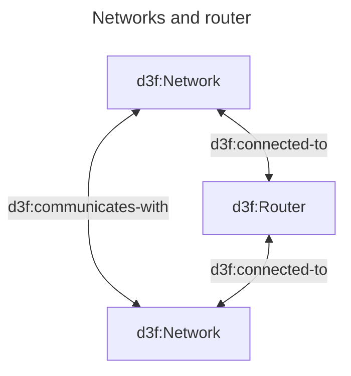
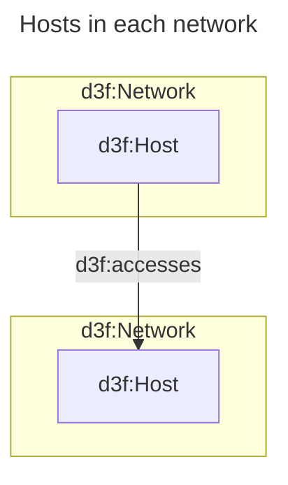
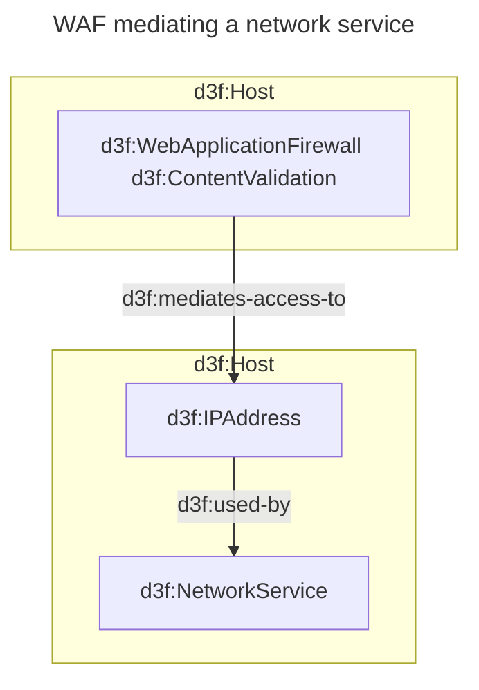

# Layers

Two networks connected via a router.

```mermaid
---
id: net
title: Networks and router
---
graph

n1[d3f:Network]
n2[d3f:Network]

router[d3f:Router]

n1 <-->|d3f:communicates-with| n2
n1 <-->|d3f:connected-to| router <-->|d3f:connected-to| n2
```

Each network has a host.

```mermaid
---
id: host
title: Hosts in each network
---
graph

subgraph n1[d3f:Network]
    h1[d3f:Host]
end

subgraph n2[d3f:Network]
    h2[d3f:Host]
end

h1 -->|d3f:accesses| h2

```

The first host runs a WAF
and proxies the second host's network service.

```mermaid
---
id: process
title: WAF mediating a network service
---
graph

subgraph h1[d3f:Host]
    p1[d3f:WebApplicationFirewall d3f:ContentValidation]
end

subgraph h2[d3f:Host]
    p2[d3f:NetworkService]
    port[d3f:IPAddress]
    port-->|d3f:used-by| p2
end

p1 -->|d3f:mediates-access-to| port

```
