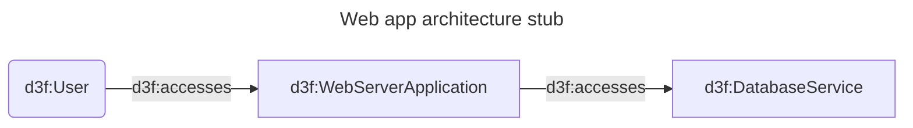

# Guided tour

Welcome to Design & D3fend. This is a very short
tour to guide you through the basic features of the editor.

Here you can find a very brief architecture of a web app.
We added `d3f:User`, `d3f:WebServerApplication`, and `d3f:DatabaseService` to the diagram to help you kickstart.



The D3FEND Graph pane shows a visual representation of the architecture:
you can focus on it pressing `alt+G` or double-clicking on the diagram.

## Discover information

Hover your mouse on any `d3f:` node
in the editor, to see its definition and description.

Go to `d3f:User` and press `TAB` to see all the other
entities related to it: e.g., you should see `d3f:UserAccount`.

## Add details via the D3FEND Graph pane: user account and credential

On the D3FEND Graph pane,
double-click on the `u d3f:User` node:
the node information panel will open.

It contains:

- a definition of the node,
- ATTACKS that can be performed on it,
- DEFENSES that can be applied to it,
- RELATIONS with other nodes in the architecture.

In the "RELATIONS" panel, you can add a new node to the architecture clicking on `+`:
add the `d3f:UserAccount` and press `ESC` to close the node information panel. You should see the new node in the D3FEND Graph pane.

The mermaid text in the editor should look like this:

```
graph

u(d3f:User)
%% Added via UI
useraccount[d3f:UserAccount User Account]
u -->|d3f:has-account| useraccount
api[d3f:WebServerApplication]
mysql[d3f:DatabaseService]

u -->|d3f:accesses| api
api -->|d3f:accesses| mysql

```

Now double-click on `useraccount` and add a `d3f:Credential`
to protect it: a credential is now shown.

Open the `credential d3f:Credential` node information panel:
the ATTACK section provides a list of attacks. Hovering the
mouse on them provides a brief description.

The DEFENSE section mentions d3f:Multi-factorAuthentication as a possible defense. Add it to the architecture by clicking on `+`.
You can add further defenses, such as d3f:CredentialRotation.

The mermaid code in the editor should look like this:

```
graph

u(d3f:User)
%% Added via UI
useraccount[d3f:UserAccount User Account]
%% Added via UI
credential[d3f:Credential]
%% Added via UI
credentialrotation[d3f:CredentialRotation Credential Rotation]
credentialrotation -->|d3f:regenerates| credential
%% Added via UI
multi-factorauthentication[d3f:Multi-factorAuthentication Multi-factor Authentication]
multi-factorauthentication -->|d3f:uses| credential
credential -->|d3f:authenticates| useraccount
u -->|d3f:has-account| useraccount
api[d3f:WebServerApplication]
mysql[d3f:DatabaseService]

u -->|d3f:accesses| api
api -->|d3f:accesses| mysql

```

## Discover related artifacts via SPARQL

Let's focus on the backend infrastructure now.
Select the `db d3f:DatabaseService` node in the D3FEND Graph pane and press `alt+Q` to open the SPARQL Query pane. This allows querying the cybersecurity dataset provided by D3FEND.

In the SPARQL Query pane,
press `alt+k` to open the list of available datasets,
and select the `d3fend` one. Then, in the "Queries" drop-down,
select the "Artifact nighbours (CONSTRUCT)" query
and press `CTRL+ENTER` to run it.

It will show some related artifacts that you can add
to the architecture:

subject	predicate	object	graph
d3f:DatabaseService	d3f:executes	d3f:DatabaseQuery
d3f:DatabaseService	d3f:manages	d3f:Database
d3f:DatabaseServiceApplication	d3f:instructs	d3f:DatabaseService

Depending on your needs, you can add all the components of interest
manually.
SPARQL is more flexible than the D3FEND Graph pane,
but requires more semantic knowledge.
Start using it for exploring.

## Backend architecture

Now we're going to add more details to the backend architecture
via the D3FEND Graph pane.

Double-click on the `mysql d3f:DatabaseService` node and:

1. add a `d3f:DatabaseQuery`;
1. add a `d3f:Database`.

Double-clicking on `databasequery` and `database` nodes
we see that they are related by:

```text
databasequery -->|d3f:queries| database
```

Manually add this line in the editor:
adding it via the D3FEND Graph pane would otherwise
create a new node since we alread have a `database` node in the architecture.

To add one further detail, we should specify that
while the `d3f:DatabaseService` executes the `d3f:DatabaseQuery`, it is the `d3f:WebServerApplication` that produces it. Add this relation in the editor:

```text
api -->|d3f:produces| databasequery
```

to model a complete backend flow.

## Protecting the backend

Check for unprotected nodes using the SPARQL pane `alt+Q`
and the "Artifacts with no defensive measures" query:
it shows the following list:

```
?artifact	?label	?class
G:api		d3f:WebServerApplication
G:database		d3f:Database
G:db		d3f:DatabaseService
G:databasequery	"Database Query"	d3f:DatabaseQuery
G:useraccount	"User Account"	d3f:UserAccount
```

Click on the `G:database` node to focus on it,
then double-click to open the information panel,
and add the `d3f:RestoreDatabase` technique.

Click on the `G:databasequery` node to focus on it,
then double-click to open the information panel,
and add the `d3f:DatabaseQueryStringAnalysis` technique.
As a further caveat, add the
`d3f:T1190 Exploit Public-Facing Application` too.

## Filtering relations

We now see that the diagram is getting crowded. We can filter
artifacts and relations shown in the D3FEND Graph pane.
In the D3FEND Graph pane, press `alt+L` to open the "Filter relations" panel,
and uncheck the "control-flow" relations: you can re-enable them later.
Do the same to hide tactical resources (i.e. d3f:CyberTechnique).

## Grouping

Artifacts can be grouped when they are related by a `d3f:contains`/`d3f:contained-by` relation.
A simple way to group them is to enclose them in a mermaid subgraph
that is a `d3f:Network`.

For the client side this can be done via

```text
%% User is a d3f:Agent, can't be contained in a d3f:Network.
u(d3f:User)

subgraph client[client d3f:Network]
  useraccount[d3f:UserAccount User Account]
  credential[d3f:Credential]
    multi-factorauthentication[d3f:Multi-factorAuthentication Multi-factor Authentication]
    credentialrotation[d3f:CredentialRotation Credential Rotation]
end
```

Continue to experiment with Design & D3FEND, until you
get something like the "Simple Webapp" example.
