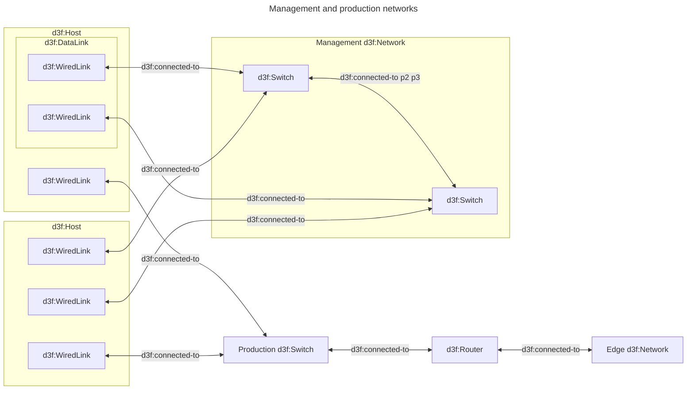

# Network diagram

- Two networks: management and production
- Two d3f:Host nodes connected to each network
- a 3rd network connected to production via a d3f:Router

```mermaid
---
id: net
title: Management and production networks
---
graph LR

subgraph mgmt[Management d3f:Network]
    mgmt-s0[d3f:Switch]
    mgmt-s1[d3f:Switch]
    mgmt-s0 <-->|d3f:connected-to p2 p3| mgmt-s1
end


prod[Production d3f:Switch]
edge-net[Edge d3f:Network]


subgraph h1[d3f:Host]
  subgraph h1_veth[d3f:DataLink]
    h1_eth0[d3f:WiredLink]
    h1_eth2[d3f:WiredLink]
  end

  h1_eth1[d3f:WiredLink]
end

subgraph h2[d3f:Host]
  h2_eth0[d3f:WiredLink]
  h2_eth2[d3f:WiredLink]
  h2_eth1[d3f:WiredLink]
end

router[d3f:Router]

h1_eth0 <-->|d3f:connected-to| mgmt-s0
h1_eth2 <-->|d3f:connected-to| mgmt-s1
h2_eth0 <-->|d3f:connected-to| mgmt-s0
h2_eth2 <-->|d3f:connected-to| mgmt-s1

h1_eth1 <-->|d3f:connected-to| prod
h2_eth1 <-->|d3f:connected-to| prod


prod <-->|d3f:connected-to| router <-->|d3f:connected-to| edge-net

```
