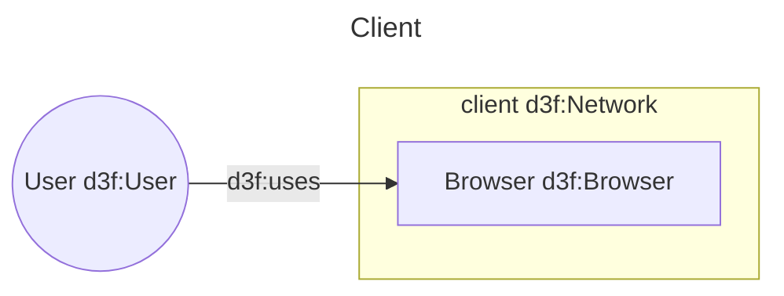
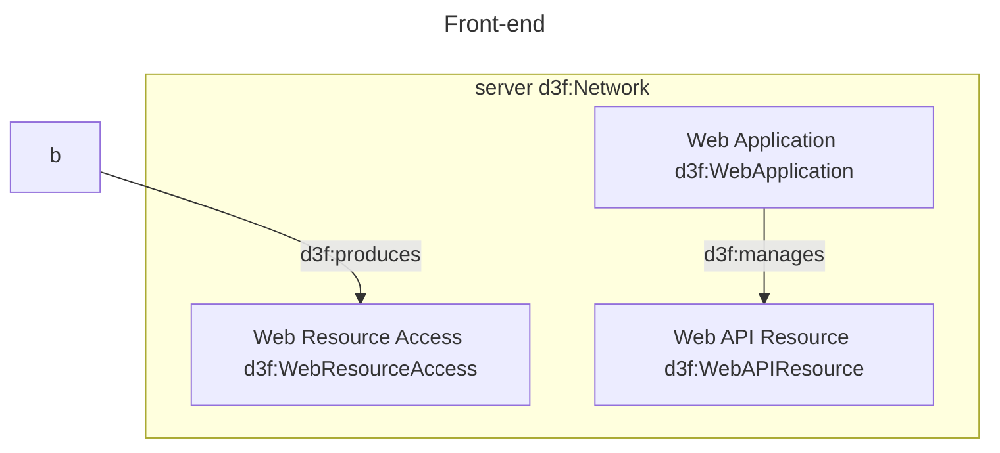
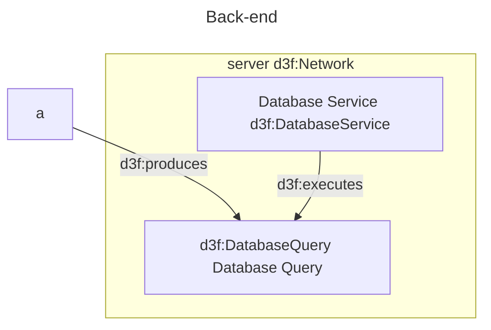
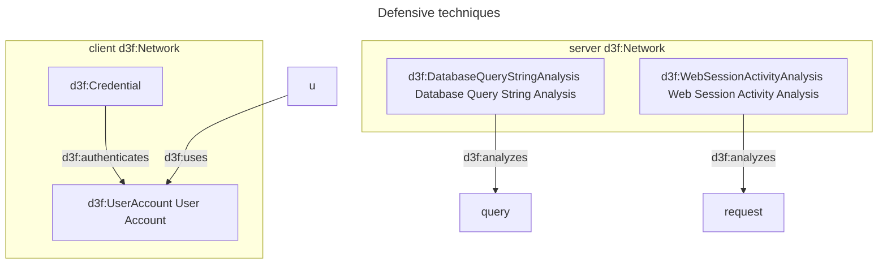
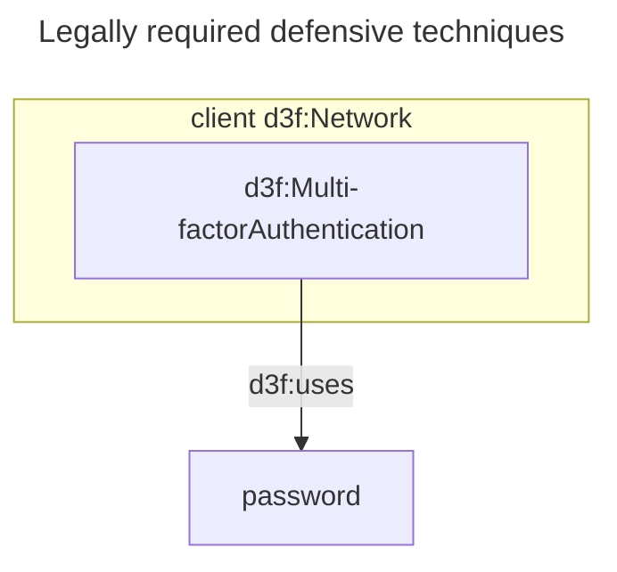

# A simple webapp

A simple web application
accessed from the client network
via a browser
producing requests to a web API.



The API is in the server  network
and is accessed by the request





Defensive techniques can be applied to the web application, the web API, and the database service.



The Web Application Firewall
is then introduced to protect the API:
the direct link between
request-->api above is removed.

```mermaid
---
title: Add WAF
id: defenses
---

subgraph server
  waf[d3f:WebApplicationFirewall d3f:Endpoint-basedWebServerAccessMediation]
end

request -->|d3f:access| waf
waf -->|d3f:mediates-access-to| api
```

Add MFA to comply with "NIS2 Article 21(2)".


