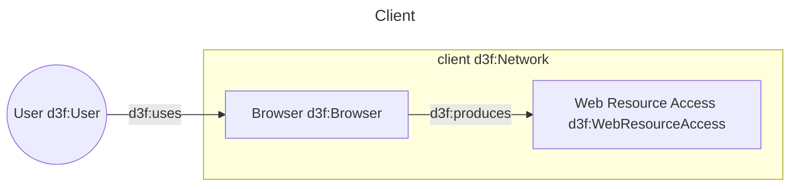
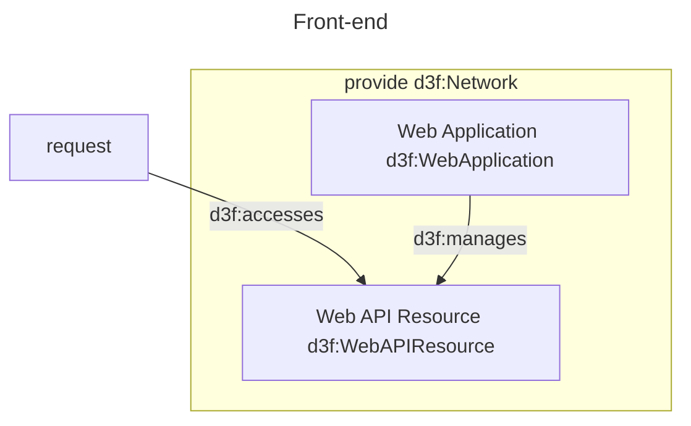
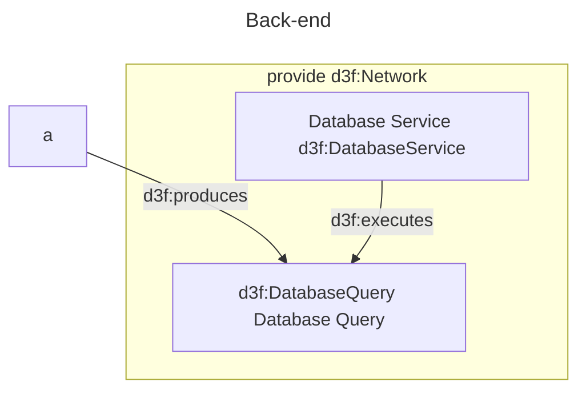

# A simple webapp

A simple web application
accessed from the client network
via a browser
producing requests to a web API.

```mermaid
---
id: client
title: Client
---
graph LR

u((User d3f:User))

subgraph client[client d3f:Network]
b[Browser d3f:Browser]
request[Web Resource Access d3f:WebResourceAccess]
end
u -->|d3f:uses| b
b -->|d3f:produces| request
```

The API is in the provider network
and is accessed by the request

```mermaid
---
id: fe
title: Front-end
---
graph

subgraph provider[provide d3f:Network]
a[Web Application d3f:WebApplication]
api[Web API Resource d3f:WebAPIResource]
end

request -->|d3f:accesses| api
a -->|d3f:manages| api
```

```mermaid
---
id: be
title: Back-end
---
graph

subgraph provider[provide d3f:Network]
  db[Database Service d3f:DatabaseService]
  query[d3f:DatabaseQuery Database Query]
end

a -->|d3f:produces| query
db -->|d3f:executes| query
```
