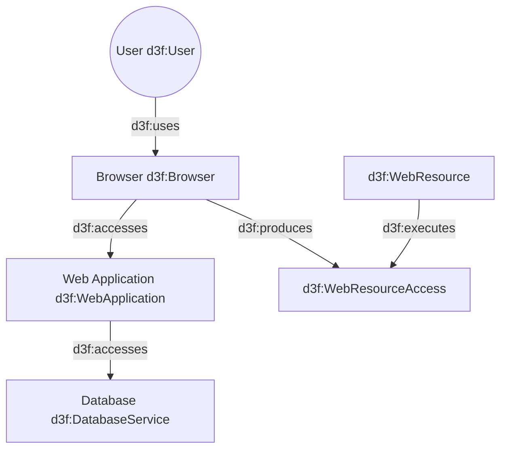

# A simple webapp

```mermaid
graph

u((User d3f:User))

b[Browser d3f:Browser]
a[Web Application d3f:WebApplication]
db[Database d3f:DatabaseService]

u -->|d3f:uses| b
b -->|d3f:accesses| a
a -->|d3f:accesses| db

b -->|d3f:produces| request
request[d3f:WebResourceAccess]

api[d3f:WebResource]

api -->|d3f:executes| request

```
