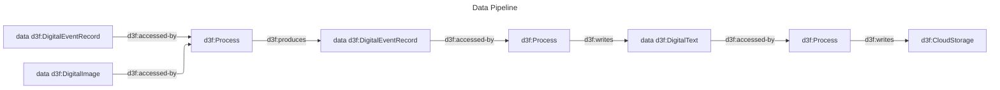
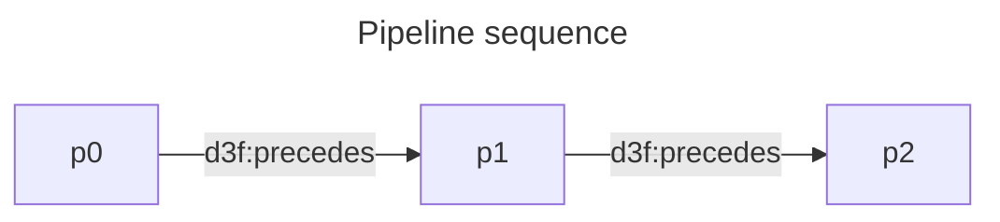

# Data Pipeline

A data pipeline have data sources and data sinks.

Data is modeled as a series of artifacts
that goes from one process to another, and each process can be a data source or a data sink.

Sequentiality is
described by the `d3f:precedes` property.

