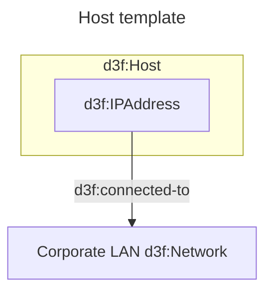
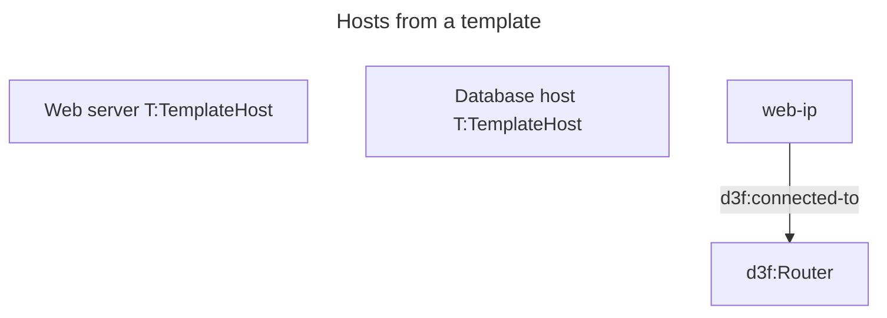

# Templates

A template is a mermaid block that declares `kind: template` and names its `root:`.
A node whose label carries `T:<template id>` expands into a copy of that block.
The template block itself adds nothing to the graph.

Rules:

- `root:` is the member the reference becomes, and it takes the label written at the reference.
- Every other member is copied per instance, with the instance id prefixed: `web` and `ip` give `web-ip`.
- `:::shared` marks a member that all instances point at instead of copying: `lan` stays `lan`.
- The reference goes on a node declared on its own line, not on an edge endpoint and not on a `subgraph`.

Two hosts from the same template:

## Refining an instance

Generated ids are ordinary ids: declare `web-ip[10.0.0.1 d3f:IPAddress]` in the diagram
to add detail to that copy. Renaming `ip` in the template turns such a line into a new
unrelated node, so rename with care.

Expansion is derived and never written back to the text: edit the template block and
every instance follows.
