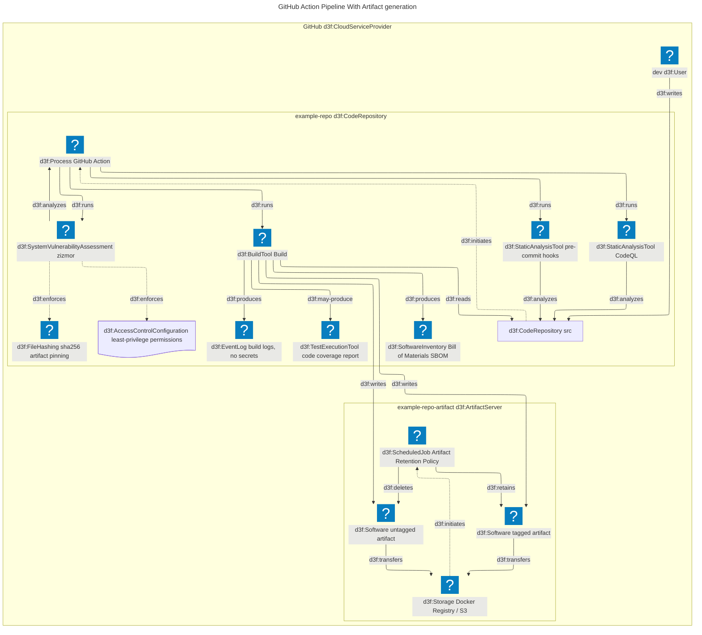

```mermaid
---
title: GitHub Action Pipeline With Artifact generation
config:
  layout: elk
---
graph

dev((dev d3f:User))@{icon: "d3f:User"}

subgraph gh["GitHub d3f:CloudServiceProvider"]
  subgraph example-repo ["example-repo d3f:CodeRepository"]
    code["d3f:CodeRepository src"]
    action["d3f:Process GitHub Action"]@{icon: "d3f:Process"}

    %% Tools
    precommit@{shape: process, label: "d3f:StaticAnalysisTool pre-commit hooks", icon: "d3f:FileFormatVerification"}
    codeql@{shape: process, label: "d3f:StaticAnalysisTool CodeQL", icon: "d3f:StaticAnalysisTool"}
    least-priv["d3f:AccessControlConfiguration least-privilege permissions"]@{shape: doc}
    sha-pin["d3f:FileHashing sha256 artifact pinning"]@{shape: doc, icon: "d3f:DigitalArtifact"}
    build[d3f:BuildTool Build]@{shape: process, icon: "d3f:Process"}

    action -->|d3f:runs| precommit -->|d3f:analyzes| code
    action -->|d3f:runs| codeql -->|d3f:analyzes| code

    zizmor@{shape: process, label: "d3f:SystemVulnerabilityAssessment zizmor", icon: "d3f:DefensiveTechnique"}
    action -->|d3f:runs| zizmor -->|d3f:analyzes| action
    zizmor -.->|d3f:enforces| least-priv
    zizmor -.->|d3f:enforces| sha-pin

    action -->|d3f:runs| build -->|d3f:reads| code

    build -->|d3f:produces| logs["d3f:EventLog build logs, no secrets"]@{shape: doc, icon: "d3f:DigitalArtifact"}

    build -->|d3f:produces| sbom["d3f:SoftwareInventory Bill of Materials SBOM"]@{shape: doc, icon: "d3f:DigitalArtifact"}

    build -->|d3f:may-produce| coverage["d3f:TestExecutionTool code coverage report"]@{shape: doc, icon: "d3f:DigitalArtifact"}
  end

  subgraph example-repo-artifact["example-repo-artifact d3f:ArtifactServer"]
    storage["d3f:Storage Docker Registry / S3"]@{icon: "d3f:AssetVulnerabilityEnumeration"}
    artifact-tag["d3f:Software tagged artifact"]@{shape: doc, icon: "d3f:DigitalArtifact"}
    artifact-untagged["d3f:Software untagged artifact"]@{shape: doc, icon: "d3f:DigitalArtifact"}

    artifact-tag -->|d3f:transfers| storage
    artifact-untagged -->|d3f:transfers| storage

    storage -.->|d3f:initiates| retention@{shape: process, label: "d3f:ScheduledJob Artifact Retention Policy", icon: "d3f:Process"}
    retention -->|d3f:retains| artifact-tag
    retention -->|d3f:deletes| artifact-untagged
  end

  build -->|d3f:writes| artifact-tag
  build -->|d3f:writes| artifact-untagged

  dev -->|d3f:writes| code
  code -.->|d3f:initiates| action
end
```
