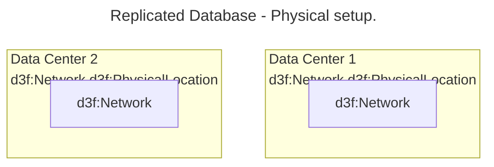
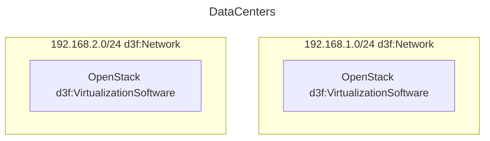
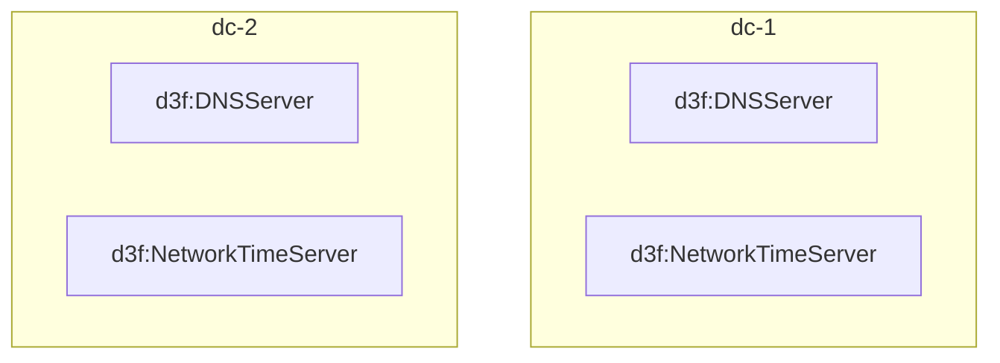
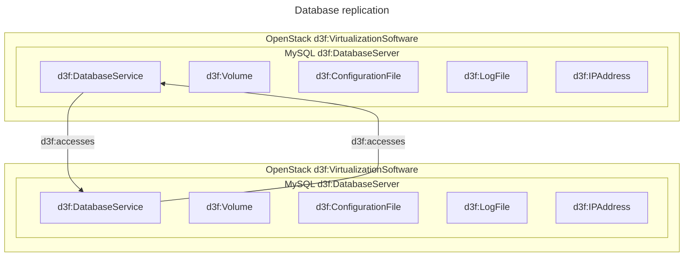
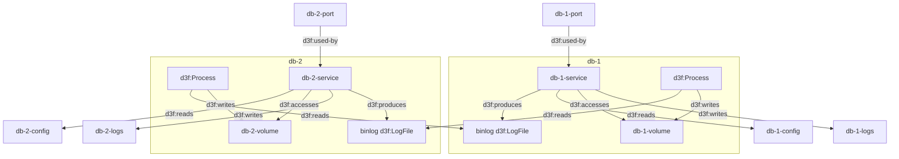

# Replicated database

To create a geographically replicated database
I setup 2 datacenters,
each with their networks.

Each datacenter d3f:Network has a d3f:VirtualizationSoftware hosting servers.

Datacenter offers DNS and NTP facilities to the servers.

I provision two d3f:DatabaseServer, one in each datacenter, and configure them to replicate data between each other.

I can further detail the replication configuration

A d3f:ClientApplication uses a d3f:DatabaseService
and backs it up to dpv:back
d3f:Record
d3f:File
d3f:WebResourceAccess
