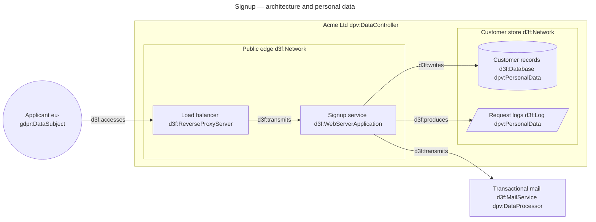
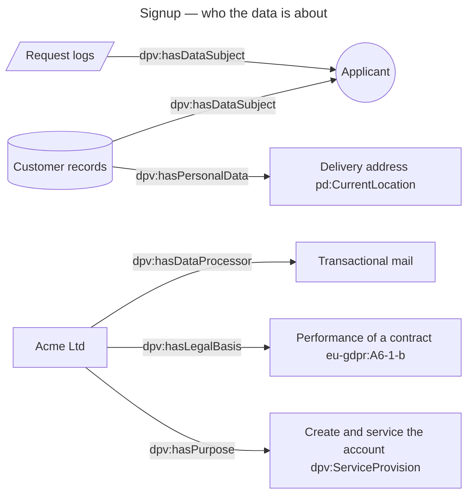

# Signup flow, in D3FEND and DPV

The architecture is D3FEND. What the data *is*, and who it is about, is DPV — the
two vocabularies annotate the same nodes, so one diagram answers both "what is
deployed" and "whose personal data does it hold"
([ADR 0028](../../../../docs/adr/0028-support-data-privacy-vocabulary.md)).

Four prefixes may be written in a diagram: `d3f:`, `dpv:`, `pd:` and `eu-gdpr:`.
The other vocabularies the editor knows — `risk:`, `eu-nis2:`, `ob:`, `al:` — are
hoverable but never types: they record a judgement *about* a system rather than a
thing in it, and a diagram that could type a box `risk:high` would lose the label.

The privacy facts are edges too, so the same graph carries them and the Links
filter can show them on their own.

A *category* of personal data is a subclass of `dpv:PersonalData`, not a predicate —
DPV has no `hasPersonalDataCategory` — so `pd:` terms are types on the node like any
other. They come from DPV's personal-data module, which `build-legal-kg.py` ships.

Both blocks carry `id: signup`, so they are one named graph and the second block's
bare ids resolve to the nodes the first declared — the merge behaviour
[merge-diagrams.md](merge-diagrams.md) demonstrates.

Things to try:

- Double-click `DB`. Its panel shows the D3FEND definition of `d3f:Database`, the
  DPV definition of `dpv:PersonalData`, and — because `d3f:Database` is not one of
  the aligned classes — no Legal section. Add `d3f:DiskEncryption` or
  `d3f:MessageEncryption` to a node and its panel gains one, naming the NIS2 and
  GDPR duties the alignment claims that technique speaks to, each marked *draft*:
  every seeded mapping is engineering judgement, not legal advice.
- Open the Links filter (`Alt+L`) and leave only `privacy` ticked: the
  architecture drops away and what remains is the personal-data story.
- Open the Nodes filter (`Alt+N`). `eu-gdpr:DataSubject` filters as an **actor**
  and `dpv:PersonalData` as an **artifact**, because they are the same concepts
  D3FEND already has a colour for. A legal basis or a purpose has no D3FEND
  counterpart, so those get their own colour and the `legal` bucket.
- In the SPARQL pane (`Alt+Q`), tick `EU legal vocabularies` and ask which drawn
  nodes are personal data without a stated legal basis.
