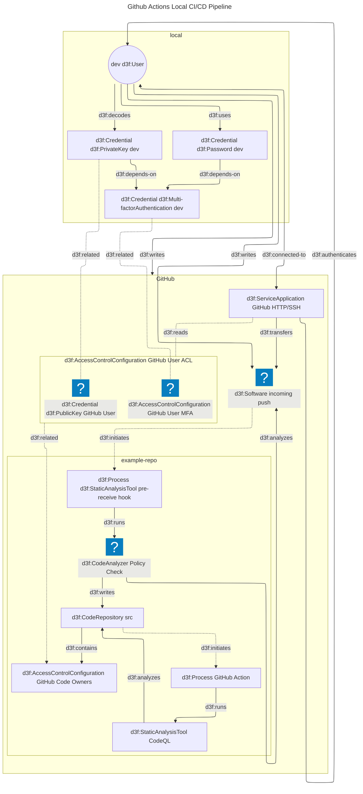

```mermaid
---
title: Github Actions Local CI/CD Pipeline
config:
  layout: elk
---
graph

subgraph local
    dev((dev d3f:User))

    dev-pk[d3f:Credential d3f:PrivateKey dev]

    dev -->|d3f:decodes| dev-pk
    dev-password[d3f:Credential d3f:Password dev]
    dev -->|d3f:uses| dev-password
    dev-mfa-token[d3f:Credential d3f:Multi-factorAuthentication dev]

    dev-password & dev-pk -->|d3f:depends-on| dev-mfa-token
end

subgraph gh["GitHub"]
  example-repo

  %% Git Services (http/ssh).
  gh-ssh[d3f:ServiceApplication GitHub HTTP/SSH]@{shape: process}


  subgraph gh-user-acl["d3f:AccessControlConfiguration GitHub User ACL"]

    gh-user-key[d3f:Credential d3f:PublicKey GitHub User]@{shape: doc, icon: "d3f:PublicKey"}
    gh-user-mfa[d3f:AccessControlConfiguration GitHub User MFA]@{shape: doc, icon: "d3f:Multi-factorAuthentication"}
  end

  %% Network exchanges
  push["d3f:Software incoming push"]@{shape: doc, icon: "d3f:Software"}
end

gh-ssh -->|d3f:authenticates| dev
gh-ssh -.-|d3f:reads| gh-user-acl
dev -->|d3f:writes| gh
dev <-->|d3f:connected-to| gh-ssh
dev-pk -.-|d3f:related| gh-user-key
dev-mfa-token -.-|d3f:related| gh-user-mfa
dev -->|d3f:writes| push
gh-ssh -->|d3f:transfers| push

subgraph example-repo ["example-repo"]
  %-code["d3f:CodeRepository src"]
  %-codeowners["d3f:AccessControlConfiguration GitHub Code Owners"]
  %-action["d3f:Process GitHub Action"]
  %-prereceive["d3f:Process d3f:StaticAnalysisTool pre-receive hook"]

  gh-user-acl -.->|d3f:related| %-codeowners
  %-code -->|d3f:contains| %-codeowners
  %-action -->|d3f:runs| %-CodeQL@{ label: "d3f:StaticAnalysisTool CodeQL"} -->|d3f:analyzes| %-code

  %-code -.->|d3f:initiates| %-action

  %-prereceive -->|d3f:runs| %-policy@{ label: "d3f:CodeAnalyzer Policy Check", icon: "d3f:CodeAnalyzer"} -->|d3f:analyzes| push
  %-policy -->|d3f:writes| %-code
push -.->|d3f:initiates| %-prereceive
end


```
