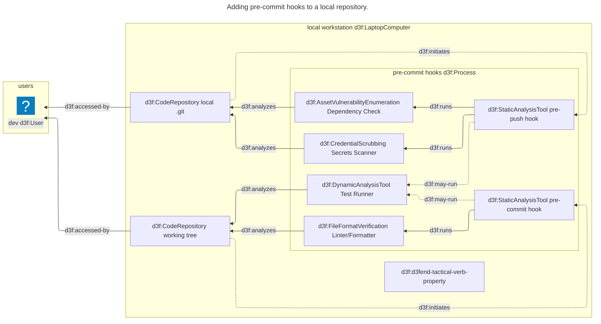

```mermaid
---
title: Adding pre-commit hooks to a local repository.
config:
  layout: elk
---
graph RL

subgraph users
  dev((dev d3f:User))@{icon: "d3f:User"}
end

worktree --->|d3f:accessed-by| dev
repo --->|d3f:accessed-by| dev

subgraph local["local workstation d3f:LaptopComputer"]
  %% Security subjects.
  repo["d3f:CodeRepository local .git"]
  worktree["d3f:CodeRepository working tree"]

  worktree -.->|d3f:initiates| hook
  subgraph pre-commit [pre-commit hooks d3f:Process]
    %% d3f:DefensiveTechnique
    hook["d3f:StaticAnalysisTool pre-commit hook"]
    hook-push["d3f:StaticAnalysisTool pre-push hook"]


    %% pre-commit
    hook -->|d3f:runs| linter

    %% Balance the speed and accuracy, e.g. use different checks in pre-commit and pre-push hooks.
    %% pre-push
    linter["d3f:FileFormatVerification Linter/Formatter"]
    secrets["d3f:CredentialScrubbing Secrets Scanner"]
    deps["d3f:AssetVulnerabilityEnumeration Dependency Check"]
    tests["d3f:DynamicAnalysisTool Test Runner"]
  end

  hook-push -->|d3f:runs| secrets -->|d3f:analyzes| repo
  hook-push -->|d3f:runs| deps -->|d3f:analyzes| repo
  hook-push & hook -.->|d3f:may-run| tests -->|d3f:analyzes| worktree

  linter -->|d3f:analyzes| worktree
  repo -.->|d3f:initiates| hook-push

  d3f:d3fend-tactical-verb-property
end
```
