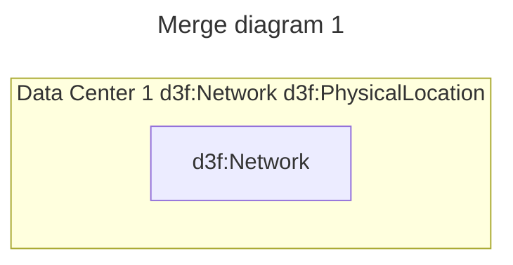
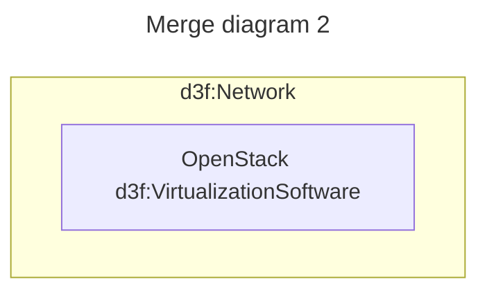

# Merge diagrams with the same id

Given



and



Then

```trig
@prefix d3f: <https://d3fend.mitre.org/ontologies/d3fend.owl#> .
@prefix G: <urn:d3fend-graph:> .
G:merge-me {
    G:dc-1 a d3f:Network, d3f:PhysicalLocation;
        rdfs:label "Data Center 1" .
    G:dc-1-net a d3f:Network;
        rdfs:label "Data Center 1" .
    G:dc-1-net d3f:hosts G:dc-1-vm .
    G:dc-1-vm a d3f:VirtualizationSoftware;
        rdfs:label "OpenStack"
}
```
