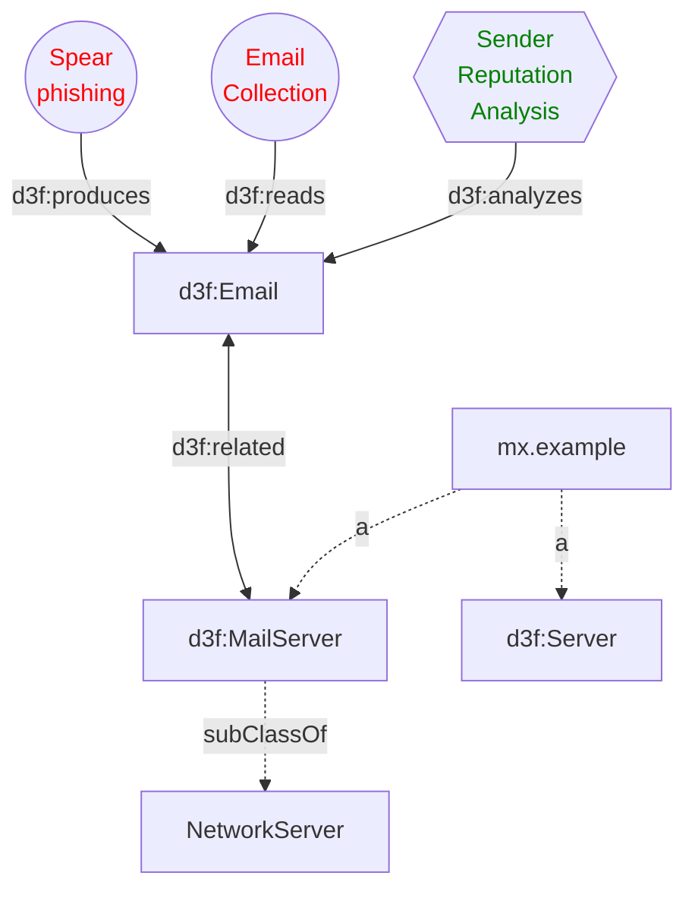

```mermaid
graph

classDef dt color:green
classDef red color:red

mx.example -.->|a| d3f:MailServer -.->|subClassOf| NetworkServer
mx.example -.->|a| d3f:Server
d3f:Email <--->|d3f:related| d3f:MailServer
%%  -->|d3f:related to| d3f:Email

SRA{{Sender<br>Reputation<br>Analysis}}:::dt -->|d3f:analyzes| d3f:Email
Local_Email_Collection((Email<br>Collection)):::red  -->|d3f:reads| d3f:Email
Spearphishing((Spear<br>phishing)):::red -->|d3f:produces| d3f:Email
```
