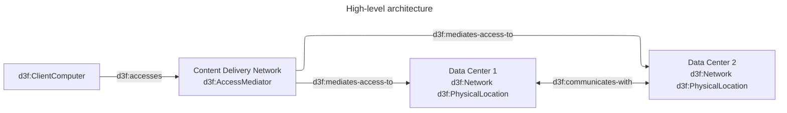
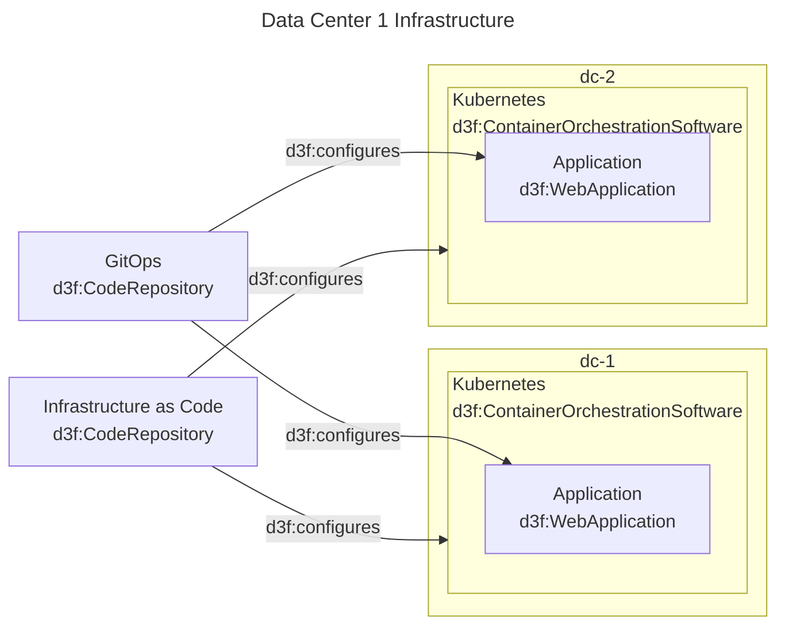

# My Architecture

This document describes an architecture
using multiple commented mermaid diagrams
in a single markdown file.

Each diagram has an identifier
and an optional title.

I start describing the high-level architecture with a diagram:



This produces the following RDF graph in turtle format:

```turtle
@prefix d3f: <https://d3fend.mitre.org/ontologies/d3fend.owl#> .
@prefix G: <urn:d3fend-graph:> .

G:hla {

    G:dc-1 a d3f:Network, d3f:PhysicalLocation;
        rdfs:label "Data Center 1" .
    G:dc-2 a d3f:Network, d3f:PhysicalLocation;
        rdfs:label "Data Center 2" .
    G:dc-1 d3f:communicates-with G:dc-2 .
    G:dc-2 d3f:communicates-with G:dc-1 .
    G:client a d3f:ClientComputer .
    G:client d3f:accesses G:CDN .
    G:CDN a d3f:AccessMediator .
    G:CDN d3f:mediates-access-to G:dc-1, G:dc-2 .

}
```

Then I detail the infrastructure of
each data center application with a second diagram:


