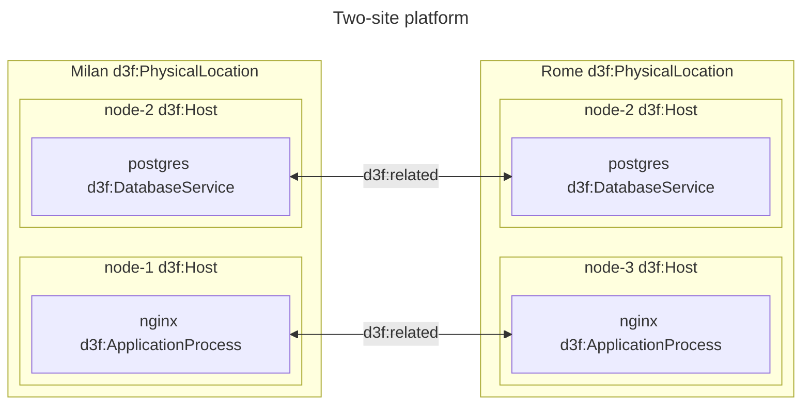
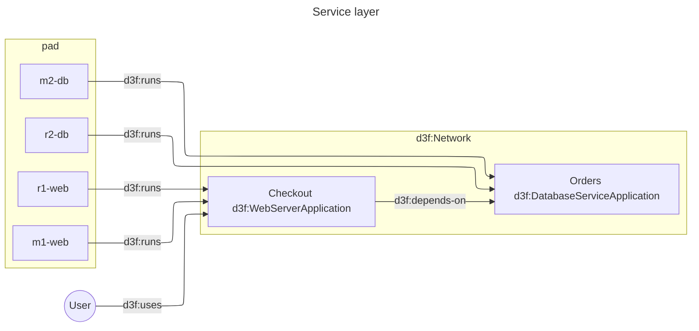

# A platform across two sites

A platform drawn so that a query can answer "if a site goes away, what stops
working?"
([ADR 0034](../../../../docs/adr/0034-platform-topology-and-location.md)).

Four levels, three predicates, no vocabulary beyond D3FEND:

- a site is a `d3f:PhysicalLocation` box — a place, not the network in it;
- a `d3f:Host` box nests inside its site, because D3FEND gives a host no location
  of its own and `d3f:contains` is transitive;
- a `d3f:ApplicationProcess` nests inside the host it runs on;
- every process that runs a service points at **one shared**
  `d3f:ServiceApplication` node with `d3f:runs`.

That shared node is the whole point. Two deployments labelled the same are two
unrelated resources; two processes pointing at one application node are the same
service, and a query can say so.



Service nodes represent logical services outside any physical site.



`d3f:DatabaseService` is the postgres *process*: its parent in D3FEND is
`d3f:ServiceApplicationProcess`, not `d3f:Application`. The database as a thing
the platform provides is `orders`, a `d3f:DatabaseApplication`.

## Query to find locations

complex service applications may span multiple applications
=> you need to traverse application parts, e.g., via d3f:contains.

```sparql
# Check that every application
#   insists on different locations
CONSTRUCT
  {
  ?app d3f:has-location ?loc
  }
WHERE {
  GRAPH ?g { ?app a ?class }
  FILTER(!STRSTARTS(STR(?g), STR(K:)))

  ?class rdfs:subClassOf* d3f:Application .
  ?app (d3f:contains*) ?component .
  ?component (d3f:contains*/d3f:depends-on) ?host .
  ?loc a d3f:PhysicalLocation ;
    d3f:contains* ?host .

    FILTER (?app != ?component)
}
ORDER BY ?app ?component
```

in d3fend, you may not only use d3f:contains. Other relations
like d3f:depends-on can be used for both physical and logical dependencies.
d3f:runs is used in a similar way, e.g.

d3f:Host d3f:runs d3f:Application .
d3f:Process d3f:runs d3f:Application .
d3f:Application

## What the checks find

Run **Applications not deployed across two sites**
(`16-application-site-coverage.rq`) and it reports `orders`, which exists only in
Milan. It does not report `checkout`, which runs in both.

Run **Dependencies missing from a site** (`17-dependency-locality.rq`) and it
reports one row: in Rome, `checkout` depends on `orders` and no process in Rome
runs it. Losing Milan takes checkout down in both sites, which the first check
called healthy — counting sites per service and checking each site is complete
are different questions, and only the second one finds this.

Fixing the diagram means adding a postgres process on a Rome host and pointing it
at the same `orders` node. Both checks then come back empty.

## Notes

- Requirements are stated between applications, not between processes:
  `checkout d3f:depends-on orders` once, rather than once per deployment.
- `d3f:accesses`, `d3f:reads` and `d3f:writes` are data flow and the checks
  ignore them. A service that writes to a log sink is not down when the sink is.
- Fault tolerance is nowhere in the graph, because D3FEND has no term for it and
  an asserted `faultTolerant` would be a claim nobody checked. The document says
  where things run and what they need; the query does the arithmetic.
- Fold Milan (`f`) and its two `d3f:runs` edges collapse into counted derived
  edges — the site is a real container, which is what nesting bought.
