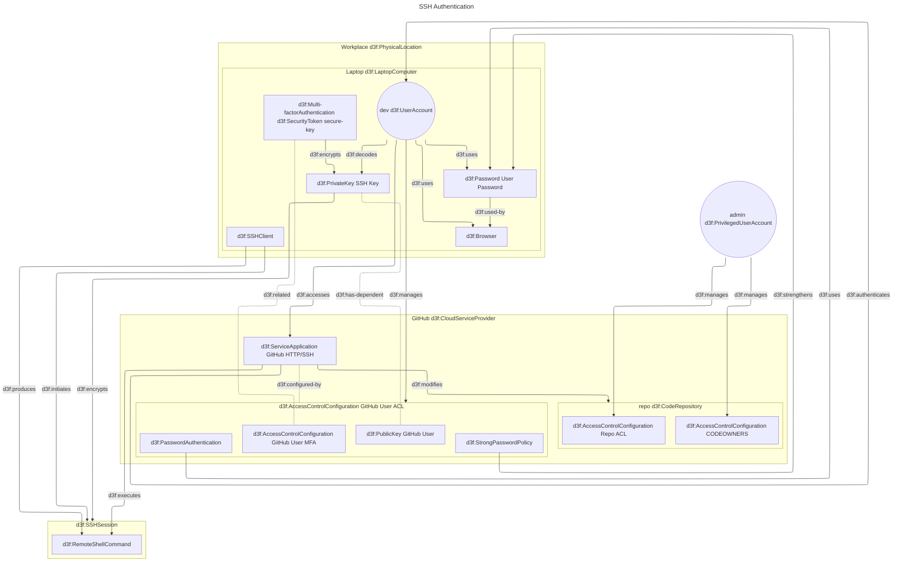
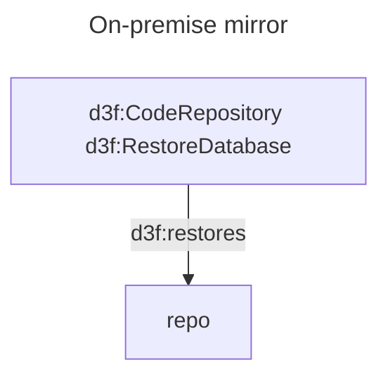

```mermaid
---
title: SSH Authentication
config:
  layout: elk
---
graph

dev-mfa-token[d3f:Multi-factorAuthentication d3f:SecurityToken secure-key]

subgraph local[Laptop d3f:LaptopComputer]
    dev((dev d3f:UserAccount))

    dev-pk[d3f:PrivateKey SSH Key]
    dev -->|d3f:uses| browser[d3f:Browser]

    dev -->|d3f:decodes| dev-pk
    dev-password[d3f:Password User Password]

    dev -->|d3f:uses| dev-password

    %% dev-password -->|d3f:depends-on| dev-mfa-token
    dev-password -->|d3f:used-by| browser
    dev-mfa-token -->|d3f:encrypts| dev-pk
    ssh-client[d3f:SSHClient]
end

subgraph workplace[Workplace d3f:PhysicalLocation]
  local
  dev-mfa-token
end

subgraph gh["GitHub d3f:CloudServiceProvider"]
  repo

  %% Git Services (http/ssh).
  gh-ssh[d3f:ServiceApplication GitHub HTTP/SSH]


  subgraph gh-user-settings["d3f:AccessControlConfiguration GitHub User ACL"]

    gh-user-key[d3f:PublicKey GitHub User]
    gh-user-mfa[d3f:AccessControlConfiguration GitHub User MFA]
    gh-password[d3f:PasswordAuthentication]
    gh-password-policy[d3f:StrongPasswordPolicy]
  end

end

gh-password -->|d3f:uses| dev-password
gh-password-policy -->|d3f:strengthens| dev-password

subgraph repo[repo d3f:CodeRepository]
    repo-acl[Repository ACL]
    repo-file-permissions[Repository File Permissions]
end

%% User configure its personal access control settings in GitHub, e.g. public key and MFA.
dev-pk -.-|d3f:has-dependent| gh-user-key
dev-mfa-token -.-|d3f:related| gh-user-mfa
repo-file-permissions[d3f:AccessControlConfiguration CODEOWNERS]
repo-acl[d3f:AccessControlConfiguration Repo ACL]

dev -->|d3f:manages| gh-user-settings
dev -->|d3f:accesses| gh-ssh

gh-ssh -->|d3f:authenticates| dev
gh-ssh -.-|d3f:configured-by| gh-user-settings


%% Admin configures user privilegs.
admin((admin d3f:PrivilegedUserAccount))
admin -->|d3f:manages| repo-acl
admin -->|d3f:manages| repo-file-permissions
%% dev -->|d3f:may-access| repo-file-permissions
ssh-client -->|d3f:produces| ssh-commands

subgraph ssh-session[d3f:SSHSession]
  ssh-commands[d3f:RemoteShellCommand]
end
ssh-client -->|d3f:initiates| ssh-session
gh-ssh -->|d3f:executes| ssh-commands
dev-pk -->|d3f:encrypts| ssh-session
gh-ssh -->|d3f:modifies| repo

```

On-premise mirror

```mermaid
---
title: On-premise mirror
---
graph

backup[d3f:CodeRepository d3f:RestoreDatabase]
backup -->|d3f:restores| repo
```
