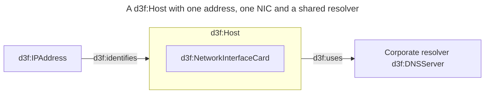
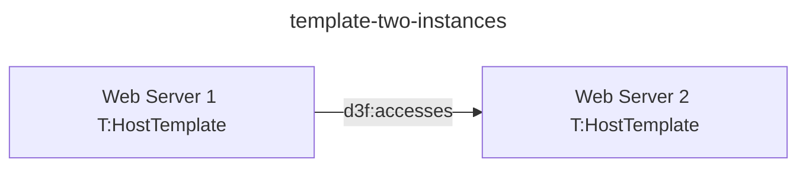
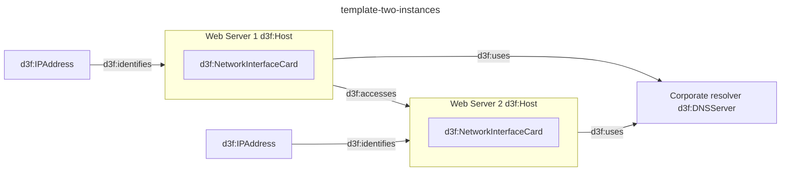

# Test case: architecture templates

The template syntax and its RDF meaning, in the
format of [testcases.md](testcases.md): the section
states a template, a diagram that instantiates it,
the mermaid the expansion produces, and the quads
the whole thing must yield.

The architecture behind it is
[ADR 0031](../../../../docs/adr/0031-architecture-templates.md).

Two things to know about this file:

- It is executable, but not by
  [rdf-emit.test.js](../../../test/rdf-emit.test.js), which reads `testcases.md`
  by name and feeds only the *first* mermaid block of a section to the parser.
  A template case needs the whole document, so it is driven by
  [templates.test.js](../../../test/templates.test.js) instead. That test also
  asserts the third block below: it is *output*, so it is not fed in as input —
  its quads are compared with the ones expansion generates, which is what keeps
  the documented expansion from drifting from the code.
- The example picker does not offer it. `testcase*.md` is excluded from the glob
  that fills the selector
  ([ADR 0010](../../../../docs/adr/0010-example-diagram-selector.md)), because a
  specification is not a diagram to open.

Prefixes this case fixes, following how the existing
sub-namespaces are named (`E:` is
`urn:d3fend-graph:enrichment:`, `N:` is
`urn:d3fend-graph:nbr:`):

| Prefix | IRI                          | For        |
| ------ | ---------------------------- | ---------- |
| `T:`   | `urn:d3fend-graph:template:` | templates  |
| `ds:`  | `urn:d3sign:`                | provenance |

`ds:` is deliberately not under `urn:d3fend-graph:`:
`ds:instantiates` and `ds:partOf` are a vocabulary
this editor invents to record where a generated
resource came from, not a namespace of graphs.

Provenance is one statement per member. Which
template member a resource came from is not recorded:
it is a function of the identifier scheme, so
`ds:partOf G:ws-1` plus the local name `ws-1-nic`
already says it.

## template-two-instances

Given a template — a `d3f:Host` with one address, one
network interface card, and a resolver every instance
shares.

Three declarations, three different meanings:

- `nic` is **inside the root**, because a host really
  does contain its NIC. Nesting means containment
  here as it does everywhere else in the app.
- `ip` is **outside the root**, because a host does
  not contain its address: it is a member all the
  same, tied to the host by `d3f:identifies`, the
  relation that is actually true.
- `dns` is **marked `:::shared`**, so it is one
  resource that every instance points at rather than
  one resource per instance.

Cloning is the default and sharing is the marked
case, on purpose: a forgotten marker then yields a
visible duplicate, where the other polarity would
have ten hosts silently sharing one address.



and a diagram that instantiates it twice.



Then expansion produces this block. It is **virtual**:
handed to the parser and to the mermaid preview,
never written into the document — inserting it would
make this a snippet, and edits to the template would
stop reaching the instances.

It is the block above with each reference line
replaced, so it keeps that block's `id` — its quads
land in that diagram's graph — and everything the
block said that was not a reference, the call-site
edge included. The root comes back as a subgraph
wearing the call-site label, the cloned members are
prefixed, and `dns` is declared once, unprefixed and
unmarked: expansion has consumed the marker.



A shared member is written once per instance and is
one resource all the same: `dns` appears twice above
because each instance's expansion declares what it
refers to, and one id is one resource.

Two things about that block are load-bearing.

It declares `ws-1` and `ws-2` as *subgraphs* where
the source declared them as nodes. That is the id
merging `merge-diagrams-with-same-id` already covers:
one id is one resource, and the subgraph declaration
is what types and labels it — a node carrying no
class emits nothing at all, so the call site
contributes only its edge.

And it has to be parsed *with* the document, not on
its own: `ws-1 -->|d3f:accesses| ws-2` has endpoints
that are untagged in their own block, so that edge
survives only because `taggedIds` is collected across
every block.

Then the quads. Everything below comes from the
virtual block except the provenance, which the
emitter adds from the member-to-instance map that
expansion returns alongside the text. Mermaid cannot
express membership — an edge label needs a writable
vocabulary prefix, and its only grouping device is
`subgraph`, which means `d3f:contains` — so writing
provenance as mermaid would mean either making `ds:`
hand-writable or asserting containment that is not
true.

`ds:partOf` is read as structure, the way
`d3f:contains` is: it groups the members into the
instance's box and is never also drawn as a link. A
membership statement drawn as a link would be one
edge per member — the drawing the box exists to
replace.

```trig
@prefix d3f: <http://d3fend.mitre.org/ontologies/d3fend.owl#> .
@prefix rdfs: <http://www.w3.org/2000/01/rdf-schema#> .
@prefix G: <urn:d3fend-graph:> .
@prefix T: <urn:d3fend-graph:template:> .
@prefix ds: <urn:d3sign:> .

G:template-two-instances {
    # The root takes the types of the template root
    # and the label written at the call site. Its
    # containment comes from the root subgraph.
    G:ws-1 a d3f:Host ;
        rdfs:label "Web Server 1" ;
        ds:instantiates T:HostTemplate ;
        d3f:contains G:ws-1-nic .

    # Cloned members carry no rdfs:label, because the
    # template's members carry none: the drawing
    # falls back to the id.
    G:ws-1-nic a d3f:NetworkInterfaceCard ;
        ds:partOf G:ws-1 .
    G:ws-1-ip a d3f:IPAddress ;
        ds:partOf G:ws-1 .

    # The template's own relations, re-pointed at this
    # instance. ip identifies the host; it is not
    # contained by it.
    G:ws-1-ip d3f:identifies G:ws-1 .
    G:ws-1 d3f:uses G:dns .

    G:ws-2 a d3f:Host ;
        rdfs:label "Web Server 2" ;
        ds:instantiates T:HostTemplate ;
        d3f:contains G:ws-2-nic .

    G:ws-2-nic a d3f:NetworkInterfaceCard ;
        ds:partOf G:ws-2 .
    G:ws-2-ip a d3f:IPAddress ;
        ds:partOf G:ws-2 .

    G:ws-2-ip d3f:identifies G:ws-2 .
    G:ws-2 d3f:uses G:dns .

    # The shared member: stated once, id unprefixed,
    # and no ds:partOf, because it belongs to no one
    # instance. Both roots point at this resource.
    G:dns a d3f:DNSServer ;
        rdfs:label "Corporate resolver" .

    # Written at the call site, between the roots.
    G:ws-1 d3f:accesses G:ws-2
}
```
