# Test cases

The supported mermaid syntax and its RDF meaning,
one case per section. Each section feeds its first
`mermaid` block to the parser and the emitter, and
the result is snapshotted in
[app/test/snapshots](../../../test/snapshots) by
`rdf-emit.test.js`. The `turtle` block states the
expected quads for a reader; the snapshot is what
the test asserts.

The architecture behind these cases is
[ADR 0003](../../../../docs/adr/0003-diagram-to-trig.md).

## id-is-graph-name

Given

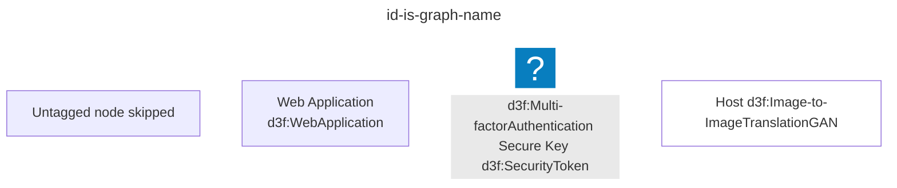

Then

```turtle
@prefix d3f: <https://d3fend.mitre.org/ontologies/d3fend.owl#> .
@prefix G: <urn:d3fend-graph:> .
G:id-is-graph-name {
    G:webapp a d3f:WebApplication;
        rdfs:label "Web Application" .
    G:token a d3f:Multi-factorAuthentication, d3f:SecurityToken;
        rdfs:label "Secure Key" .
    G:classified a d3f:Image-to-ImageTranslationGAN;
        rdfs:label "Host" .
}
```

## id-default-is-default

Given

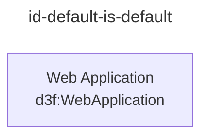

Then

```turtle
@prefix d3f: <https://d3fend.mitre.org/ontologies/d3fend.owl#> .
@prefix G: <urn:d3fend-graph:>.
G:default {
    G:webapp a d3f:WebApplication;
        rdfs:label "Web Application".
}
```

## subgraph-ignored-without-tag

Given

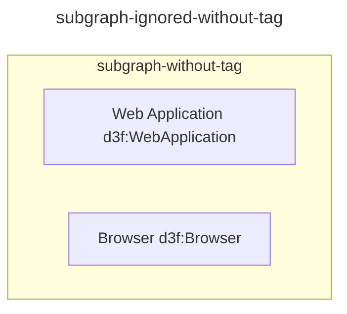

Then

```turtle
@prefix d3f: <https://d3fend.mitre.org/ontologies/d3fend.owl#> .
@prefix G: <urn:d3fend-graph:>.
G:default {
    G:webapp a d3f:WebApplication;
        rdfs:label "Web Application".
    G:browser a d3f:Browser;
        rdfs:label "Browser".
}
```

## subgraph-contains-with-tag

Given

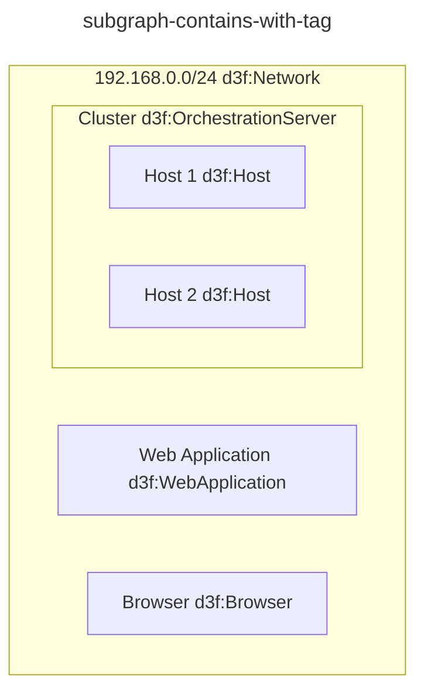

Then

```turtle
@prefix d3f: <https://d3fend.mitre.org/ontologies/d3fend.owl#>.
@prefix G: <urn:d3fend-graph:>.
G:default {
    G:webapp a d3f:WebApplication;
        rdfs:label "Web Application".
    G:browser a d3f:Browser;
        rdfs:label "Browser".

    G:net a d3f:Network;
        rdfs:label "192.168.0.0/24" ;
        d3f:contains G:webapp, G:browser, G:cluster.

    G:cluster a d3f:OrchestrationServer;
        rdfs:label "Cluster" ;
        d3f:contains G:host-1, G:host-2.
    G:host-1 a d3f:Host;
        rdfs:label "Host 1".
    G:host-2 a d3f:Host;
        rdfs:label "Host 2"
}
```

## subgraph-with-property

Given

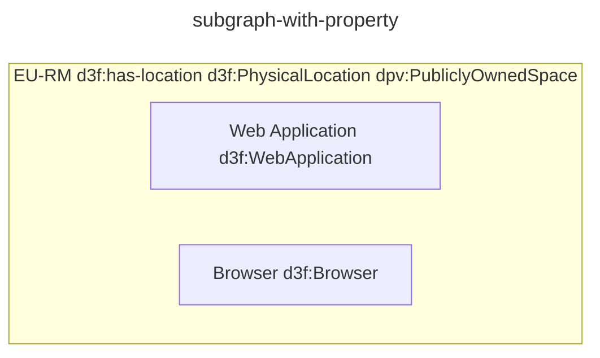

Then

```turtle
@prefix d3f: <https://d3fend.mitre.org/ontologies/d3fend.owl#> .
@prefix G: <urn:d3fend-graph:> .
G:default {
    G:dc a d3f:PhysicalLocation, dpv:PubliclyOwnedSpace;
        rdfs:label "EU-RM" ;
    G:webapp a d3f:WebApplication;
        rdfs:label "Web Application" ;
        d3f:has-location G:dc .
    G:browser a d3f:Browser;
        rdfs:label "Browser" ;
        d3f:has-location G:dc .
}
```

Location classes are not special, if no property is specified.

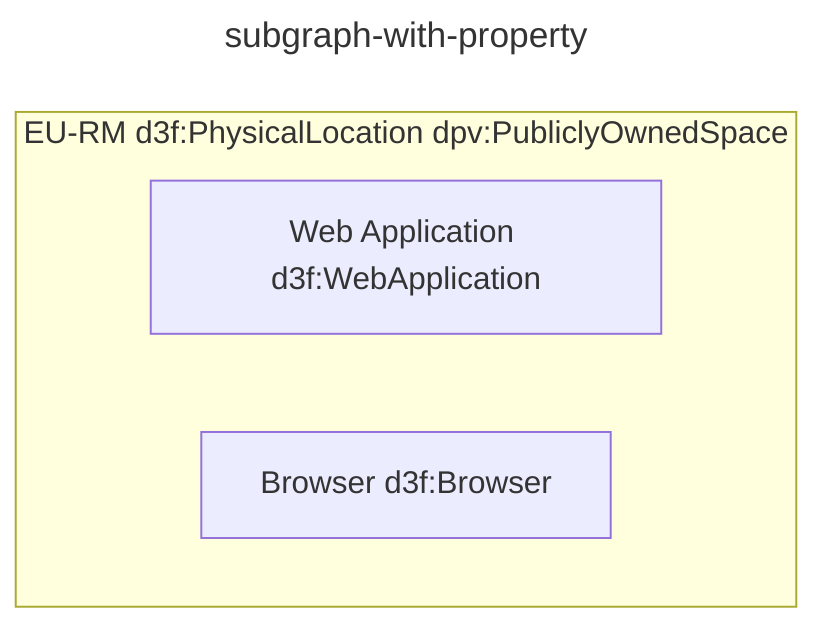

Then

```turtle
@prefix d3f: <https://d3fend.mitre.org/ontologies/d3fend.owl#> .
@prefix G: <urn:d3fend-graph:> .
G:default {
    G:dc a d3f:PhysicalLocation, dpv:PubliclyOwnedSpace;
        rdfs:label "EU-RM" ;
        d3f:contains G:webapp, G:browser .
    G:webapp a d3f:WebApplication;
        rdfs:label "Web Application" .
    G:browser a d3f:Browser;
        rdfs:label "Browser" .

}
```

## complex-node-syntax

Given

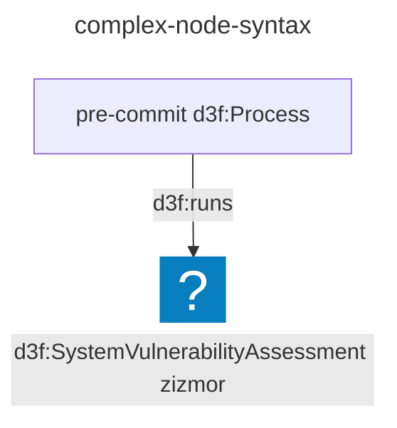

Then

```turtle
@prefix d3f: <https://d3fend.mitre.org/ontologies/d3fend.owl#>.
@prefix G: <urn:d3fend-graph:>.
G:default {
    G:zizmor a d3f:SystemVulnerabilityAssessment;
        rdfs:label "zizmor" .
    G:p a d3f:Process;
        rdfs:label "pre-commit" ;
        d3f:runs G:zizmor.
}
```

## merge-diagrams-with-same-id

Given

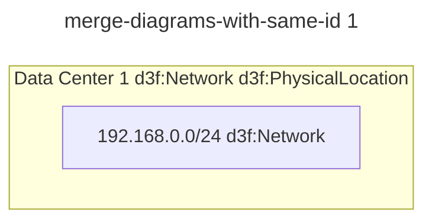

and

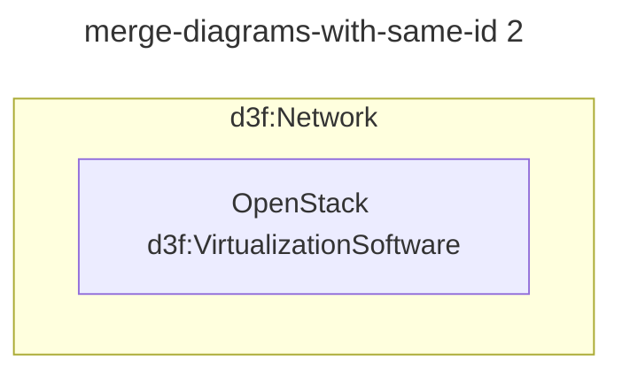

Then

```trig
@prefix d3f: <https://d3fend.mitre.org/ontologies/d3fend.owl#> .
@prefix G: <urn:d3fend-graph:> .
G:merge-me {
    G:dc-1 a d3f:Network, d3f:PhysicalLocation;
        rdfs:label "Data Center 1" .
    G:dc-1-net a d3f:Network;
        rdfs:label "Data Center 1" .
    G:dc-1-net d3f:contains G:dc-1-vm .
    G:dc-1-vm a d3f:VirtualizationSoftware;
        rdfs:label "OpenStack"
}
```

## inherit-subgraph-without-tag-1

Given

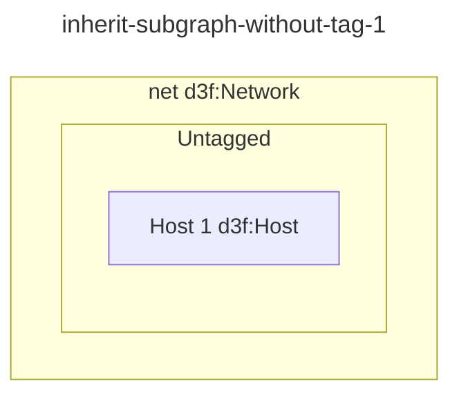

Then

```trig
@prefix d3f: <https://d3fend.mitre.org/ontologies/d3fend.owl#> .
@prefix G: <urn:d3fend-graph:> .
G:default {
    G:net a d3f:Network;
        rdfs:label "net" ;
        d3f:contains G:a .
    G:a a d3f:Host;
        rdfs:label "Host 1"
}
```

## inherit-subgraph-without-tag-2

Given

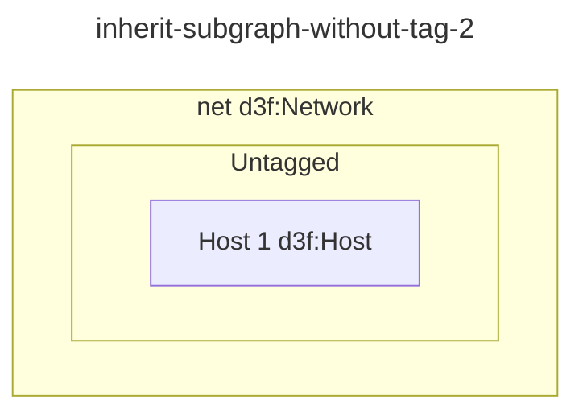

Then

```trig
@prefix d3f: <https://d3fend.mitre.org/ontologies/d3fend.owl#> .
@prefix G: <urn:d3fend-graph:> .
G:default {
    G:net a d3f:Network;
        rdfs:label "net" ;
        d3f:contains G:a .
    G:a a d3f:Host;
        rdfs:label "Host 1"
}
```

## subgraph-with-relationships

Given

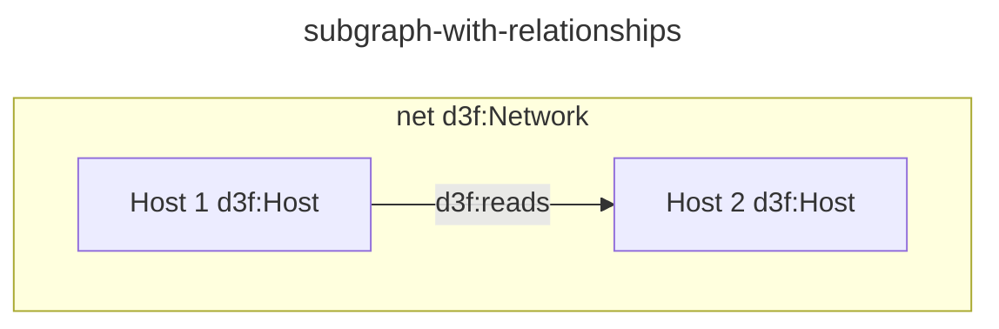

Then

```trig
@prefix d3f: <https://d3fend.mitre.org/ontologies/d3fend.owl#> .
@prefix G: <urn:d3fend-graph:> .
G:default {
    G:a a d3f:Host;
        rdfs:label "Host 1" .
    G:a d3f:reads G:b .
    G:b a d3f:Host;
        rdfs:label "Host 2" .
    G:net a d3f:Network;
        rdfs:label "net" ;
        d3f:contains G:a, G:b
}
```

## subgraph-as-relationships

Given

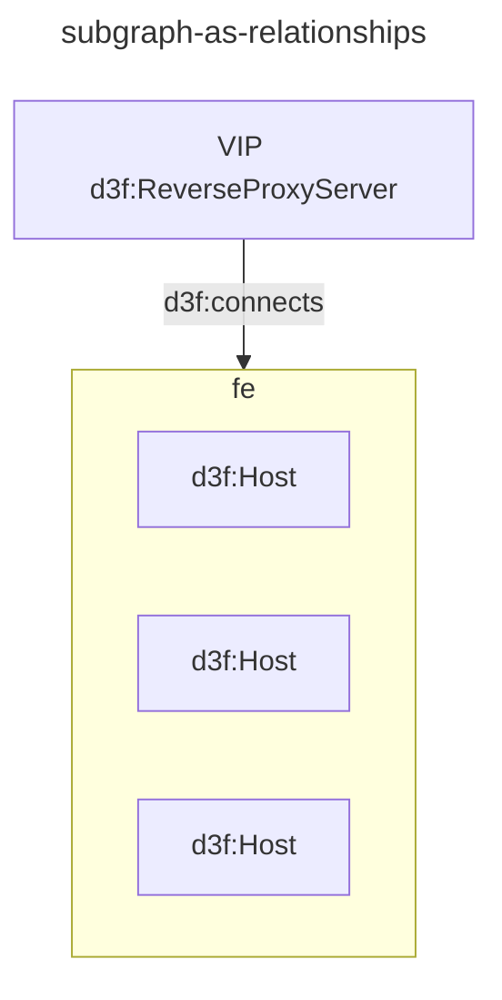

Then

```trig
@prefix d3f: <https://d3fend.mitre.org/ontologies/d3fend.owl#> .
@prefix G: <urn:d3fend-graph:> .
G:subgraph-as-relationships {
    G:h-a a d3f:Host .
    G:h-b a d3f:Host .
    G:h-c a d3f:Host .
    G:vip a d3f:ReverseProxyServer;
        d3f:connects G:h-a, G:h-b, G:h-c .
}
```

Note: To avoid accidentally fanning out relationships,
the pad-a |d3f:relation| pad-b is not supported.
Use pad-a |d3f:relation| r1 & r2 & r3 instead.

## subgraph-as-relationships-tagged

Given

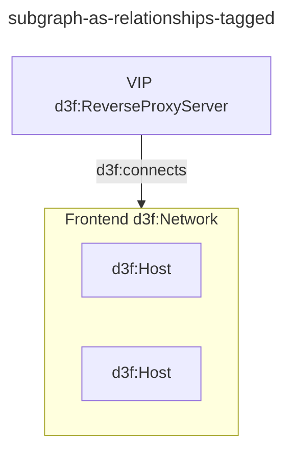

Then

```trig
@prefix d3f: <https://d3fend.mitre.org/ontologies/d3fend.owl#> .
@prefix G: <urn:d3fend-graph:> .
G:subgraph-as-relationships-tagged {
    G:net a d3f:Network;
        rdfs:label "Frontend" ;
        d3f:contains G:h-a, G:h-b .
    G:h-a a d3f:Host .
    G:h-b a d3f:Host .
    G:vip a d3f:ReverseProxyServer;
        rdfs:label "VIP" ;
        d3f:connects G:net .
}
```

## subgraph-as-relationships-members

Given

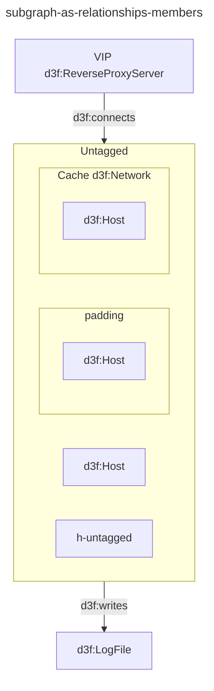

Then

```trig
@prefix d3f: <https://d3fend.mitre.org/ontologies/d3fend.owl#> .
@prefix G: <urn:d3fend-graph:> .
G:subgraph-as-relationships-members {
    G:h-a a d3f:Host .
    G:h-b a d3f:Host .
    G:h-c a d3f:Host .
    G:cache a d3f:Network;
        rdfs:label "Cache" ;
        d3f:contains G:h-c .
    G:vip a d3f:ReverseProxyServer;
        rdfs:label "VIP" ;
        d3f:connects G:h-a, G:h-b,
        # G:cache is tagged => G:h-c is not d3f:contained directly
        #   because it is a member of a tagged subgraph
        G:cache .


    G:log a d3f:LogFile .
    G:h-a d3f:writes G:log .
    G:h-b d3f:writes G:log .
    # G:h-c is not d3f:writes directly because it is a member of a tagged subgraph.
    G:cache d3f:writes G:log .
}
```

## parse-links

Given

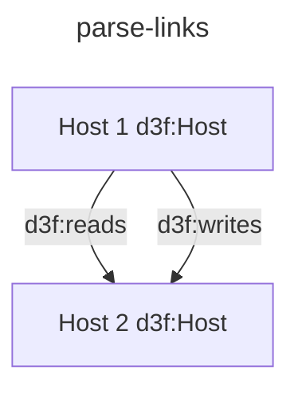

Then

```trig
@prefix d3f: <https://d3fend.mitre.org/ontologies/d3fend.owl#> .
@prefix G: <urn:d3fend-graph:> .
G:parse-links {
    G:a a d3f:Host;
        rdfs:label "Host 1" .
    G:a d3f:reads G:b .
    G:a d3f:writes G:b .
    G:b a d3f:Host;
        rdfs:label "Host 2"
}
```

## parse-link-comments

Given

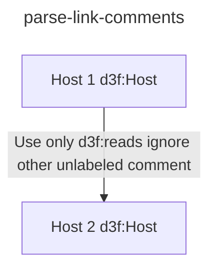

Then

```trig
@prefix d3f: <https://d3fend.mitre.org/ontologies/d3fend.owl#> .
@prefix G: <urn:d3fend-graph:> .
G:parse-link-comments {
    G:a a d3f:Host;
        rdfs:label "Host 1" .
    G:a d3f:reads G:b .
    G:b a d3f:Host;
        rdfs:label "Host 2"
}
```

## node-shape-forms

Given every mermaid node shape, plus the
`id@{key: value}` attribute form.

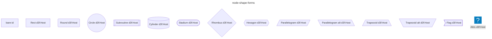

Then the shape is dropped and every tagged id
yields the same two triples.

```trig
@prefix d3f: <https://d3fend.mitre.org/ontologies/d3fend.owl#> .
@prefix G: <urn:d3fend-graph:> .
G:node-shape-forms {
    G:rect a d3f:Host; rdfs:label "Rect" .
    G:round a d3f:Host; rdfs:label "Round" .
    G:circle a d3f:Host; rdfs:label "Circle" .
    G:subroutine a d3f:Host; rdfs:label "Subroutine" .
    G:cylinder a d3f:Host; rdfs:label "Cylinder" .
    G:stadium a d3f:Host; rdfs:label "Stadium" .
    G:rhombus a d3f:Host; rdfs:label "Rhombus" .
    G:hexagon a d3f:Host; rdfs:label "Hexagon" .
    G:parallelogram a d3f:Host;
        rdfs:label "Parallelogram" .
    G:parallelogram-alt a d3f:Host;
        rdfs:label "Parallelogram alt" .
    G:trapezoid a d3f:Host; rdfs:label "Trapezoid" .
    G:trapezoid-alt a d3f:Host;
        rdfs:label "Trapezoid alt" .
    G:flag a d3f:Host; rdfs:label "Flag" .
    G:attrs a d3f:Host; rdfs:label "Attrs"
}
```

## edge-forms

Given the labelled-arrow forms.

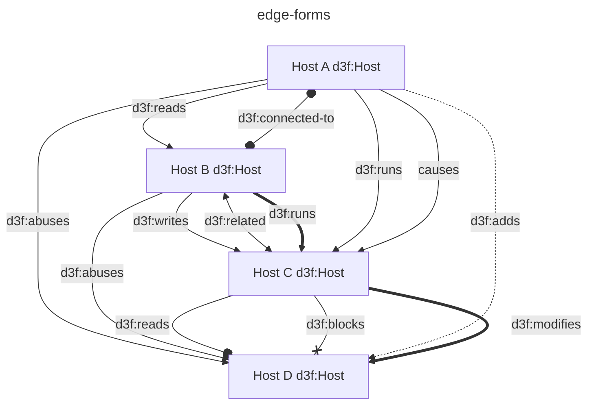

Then

```trig
@prefix d3f: <https://d3fend.mitre.org/ontologies/d3fend.owl#> .
@prefix G: <urn:d3fend-graph:> .
G:edge-forms {
    G:a a d3f:Host;
        rdfs:label "Host A" .
    G:b a d3f:Host;
        rdfs:label "Host B" .
    G:c a d3f:Host;
        rdfs:label "Host C" .
    G:d a d3f:Host;
        rdfs:label "Host D" .
    G:a d3f:reads G:b .
    G:b d3f:writes G:c .
    G:a d3f:abuses G:d .
    G:b d3f:abuses G:d .
    G:c d3f:reads G:d .
    G:c d3f:blocks G:d .
    G:b d3f:related G:c .
    G:c d3f:related G:b .
    G:a d3f:connected-to G:b .
    G:b d3f:connected-to G:a .
    G:a d3f:adds G:d .
    G:b d3f:runs G:c .
    G:a d3f:runs G:c .
    G:c d3f:modifies G:d .
}
```

## unlabelled-arrows-dropped

Given arrows with no `|predicate|`.

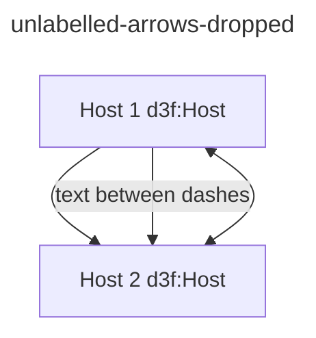

Then only the nodes are emitted.

```trig
@prefix d3f: <https://d3fend.mitre.org/ontologies/d3fend.owl#> .
@prefix G: <urn:d3fend-graph:> .
G:unlabelled-arrows-dropped {
    G:a a d3f:Host;
        rdfs:label "Host 1" .
    G:b a d3f:Host;
        rdfs:label "Host 2"
}
```

## back-arrows-rejected

Given arrows with a head on the left only.

```mermaid
---
id: back-arrows-rejected
title: back-arrows-rejected
---
graph

a[Host 1 d3f:Host]
b[Host 2 d3f:Host]

%% WHEN a head sits on the left and nowhere else
%% THEN the line is a mermaid syntax error:
%%   `<--`, `o--` and `x--` only open a link that
%%   a head on the right has to close. Nothing is
%%   emitted, a warning names the arrow, and the
%%   editor paints the line red.
a <--|d3f:reads| b
a o--|d3f:reads| b
a x--|d3f:reads| b
a <-- b
```

Then only the nodes are emitted.

```trig
@prefix d3f: <https://d3fend.mitre.org/ontologies/d3fend.owl#> .
@prefix G: <urn:d3fend-graph:> .
G:back-arrows-rejected {
    G:a a d3f:Host;
        rdfs:label "Host 1" .
    G:b a d3f:Host;
        rdfs:label "Host 2"
}
```

## edge-contained-by-normalized

`d3f:contained-by` is the inverse of `d3f:contains`, and
`d3f:contains` is the one predicate the graph view reads as
structure rather than as a link. Written as an edge label it
is therefore rewritten to `d3f:contains` with its ends
exchanged, so the two legs draw the same box.

```mermaid
---
id: edge-contained-by-normalized
title: edge-contained-by-normalized
---
graph

dc[EU-RM d3f:Network]
webapp[Web Application d3f:WebApplication]
browser[Browser d3f:Browser]

%% WHEN an edge names d3f:contained-by
%% THEN the emitted triple is d3f:contains,
%%   subject and object exchanged.
webapp -->|d3f:contained-by| dc
browser -->|d3f:contained-by| dc

%% WHEN an edge names any other predicate
%% THEN it is written as drawn.
webapp -->|d3f:uses| browser
```

Then

```trig
@prefix d3f: <https://d3fend.mitre.org/ontologies/d3fend.owl#> .
@prefix G: <urn:d3fend-graph:> .
G:edge-contained-by-normalized {
    G:dc a d3f:Network;
        rdfs:label "EU-RM";
        d3f:contains G:webapp, G:browser .
    G:webapp a d3f:WebApplication;
        rdfs:label "Web Application";
        d3f:uses G:browser .
    G:browser a d3f:Browser;
        rdfs:label "Browser" .
}
```

## subgraph-contained-by-normalized

The same rewrite applies to a subgraph title. A title naming
a property is normally written from the member's side —
`G:webapp d3f:has-location G:dc`, see `subgraph-with-property`
— and draws one arrow per member. `d3f:contained-by` becomes
`d3f:contains`, which is stated from the container, so the box
is drawn instead.

```mermaid
---
id: subgraph-contained-by-normalized
title: subgraph-contained-by-normalized
---
graph

%% WHEN a subgraph title names d3f:contained-by
%% THEN it emits the same quads as naming
%%   d3f:contains, or naming no property at all.
subgraph dc [EU-RM d3f:contained-by d3f:Network]
  webapp[Web Application d3f:WebApplication]
  browser[Browser d3f:Browser]
end
```

Then

```trig
@prefix d3f: <https://d3fend.mitre.org/ontologies/d3fend.owl#> .
@prefix G: <urn:d3fend-graph:> .
G:subgraph-contained-by-normalized {
    G:dc a d3f:Network;
        rdfs:label "EU-RM";
        d3f:contains G:webapp, G:browser .
    G:webapp a d3f:WebApplication;
        rdfs:label "Web Application" .
    G:browser a d3f:Browser;
        rdfs:label "Browser" .
}
```
