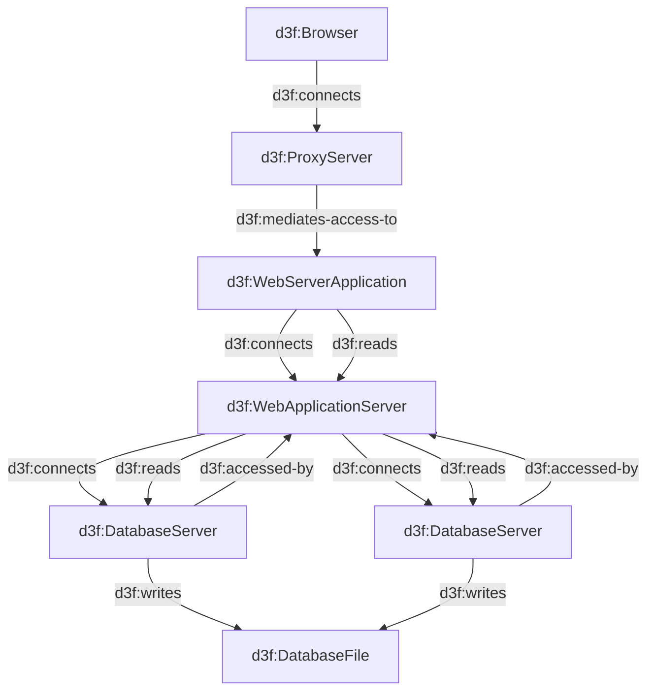

# 33. Improve flow discovery

Date: 2026-07-09

## Status

Proposed

## Context

Given a node, pressing `>` or `<` will show the
node chain in the Graph panel, following links.

Complex flows where some components have
inbound and outbound relationships can be difficult to trace.
For example in the following diagram,
the outbound relationships from dbms1 include dbms2,
that is counter-intuitive.
Is there a way to improve the visualization of complex flows to make inbound and outbound relationships clearer?

## Decision

- [x] We will use Architecture Decision Records, as [described by Michael Nygard](http://thinkrelevance.com/blog/2011/11/15/documenting-architecture-decisions).
- [x] Decision is a list of checkboxes, to be marked as the decision is implemented.
- [x] MUST NOT include implementation details, code snippets or step-by-step procedures.
- [x] Consequences section contain bullet lists of Pros and Cons.
- [x] Useful implementation details MAY go in `## DONTREADME`. That section names files, functions and
  values; the other sections do not.

## Consequences

Pros:

- See Michael Nygard's article. For a lightweight ADR toolset, see Nat Pryce's [adr-tools](https://github.com/npryce/adr-tools).
- Keeping implementation notes out of the decision
  does not mean losing them, so there is no pressure
  to smuggle them back into Context or Consequences.
- An agent reading an ADR can tell which parts it may
  rely on and which parts it must check against the
  code.

Cons:

- Requires discipline to maintain the ADRs up to date and ensure they are consulted when making decisions.
- A `## DONTREADME` section goes stale as the code
  moves. It is a hint for finding things, never a
  description of current behaviour.

## DONTREADME

This section is addressed to LLM agents and contains
names files, functions and values.
It describes the code and not the decision, and it goes stale.
Agents MUST update this section to reflect the current state of the code.
