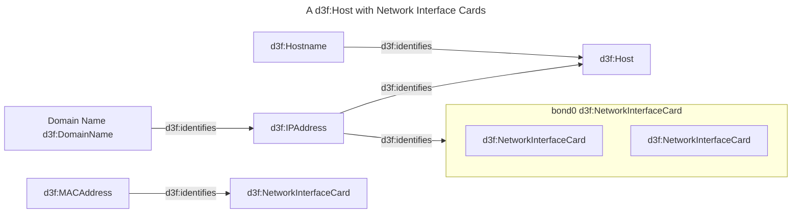
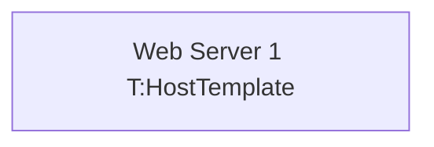

# 31. Architecture templates

Date: 2026-07-09

## Status

Accepted

## Context

When I design a system, the same shape recurs: a host with its hostname, its
addresses and its network interface cards; a service with its endpoint and its
credentials. Today each recurrence is retyped, and a correction to the shape has
to be applied everywhere it was retyped.

I want to declare the shape once as an *architecture template*, and reference it
from a single node:



I expect to be able to write:



and get:

```trig
G:ws-1 a d3f:Host ;
  rdfs:label "Web Server 1" ;
  ds:instantiates T:HostTemplate .

G:ws-1-hostname a d3f:Hostname .
G:ws-1-ip a d3f:IPAddress .
G:ws-1-mac a d3f:MACAddress .
G:ws-1-domainname a d3f:DomainName ; rdfs:label "Domain Name" .
G:ws-1-eth0 a d3f:NetworkInterfaceCard .
G:ws-1-eth1 a d3f:NetworkInterfaceCard .
G:ws-1-eth2 a d3f:NetworkInterfaceCard .
G:ws-1-bond0 a d3f:NetworkInterfaceCard ; rdfs:label "bond0" .

G:ws-1-bond0 d3f:contains G:ws-1-eth0, G:ws-1-eth1 .

G:ws-1-hostname d3f:identifies G:ws-1 .
G:ws-1-domainname d3f:identifies G:ws-1-ip .
G:ws-1-ip d3f:identifies G:ws-1 .
G:ws-1-ip d3f:identifies G:ws-1-bond0 .
G:ws-1-mac d3f:identifies G:ws-1-eth2 .

G:ws-1-hostname ds:partOf G:ws-1 .
# … one such statement per generated member, and no
# more: which member it was is already in the id.
```

Three things in that example are decisions, not notation, because a first draft
of this ADR got each of them wrong.

The template is **not referenced through the `G:` prefix**, which already names
the namespace that both named graphs and node identifiers live in: reusing it
would make one IRI a graph, a node and a class at once.

The template's root is **declared**, because nothing in the block identifies it.
The draft nested every member inside a `subgraph host[d3f:Host]` and took the
outermost subgraph as the root — but `bond0` is outermost too, so the rule does
not decide, and the nesting had a second and worse effect: a container's box is
a containment claim, so it asserted that a host contains its own hostname, its
domain name and its addresses. A hostname is not inside a host; it *identifies*
it, which the template states on the next line. Grouping the members and
asserting containment are different jobs, and the second one is not available
for the first.

The generated resources carry **provenance** in the editor's own namespace,
naming the instance they belong to and nothing else. This is bookkeeping and not
an ontological claim, so it cannot be `d3f:contains` and cannot be a `d3f:`
predicate at all — and being bookkeeping is also the reason there is one
statement of it and not two. An earlier draft also recorded which template
member each resource came from, which is a function of the identifier scheme
this ADR fixes: it said the same thing a second time, once per member per
instance, so a twenty-member template paid twenty times over for an answer its
own identifiers already gave.

Alternatives considered, each of which the tool can already do:

- **Instantiate as a snippet**: paste an expanded, id-prefixed copy of the block
  into the source, the way a relation is added from the node panel today. It
  invents no semantics and breaks no invariant, but a correction to the shape
  never reaches the copies, which is the whole point of the feature.
- **Templates as queries**: a CONSTRUCT per template, its results registered as
  a named graph per instance. Shipped machinery, and provenance and deletion
  come free with the named graph — but the shape is then authored in SPARQL,
  which is not the language the diagram is drawn in.
- **Expand from the ontology**: D3FEND already relates a host to its identifiers,
  and the editor can already mint an instance per related class. No authoring
  language at all, but the ontology cannot say that *this* bond has *these* two
  interfaces, which is exactly what a template is for.
- **Templates as shapes in RDF**, with rules expanding them. Declarative and
  independent of this tool, but the query engine runs SPARQL and not shape rules,
  so in practice this is the previous option with more ceremony.
- **Accept the repetition.** The baseline: the feature only pays for itself once
  the same shape appears many times in one document.

## Decision

- [x] A template is a **macro over the diagram**, not a class in any vocabulary.
  Instantiating it copies structure; it does not license reasoning, and nothing
  treats a template as a subclass of the type its root carries.
- [x] A template block **declares itself as a template** in its frontmatter, and
  **names its root member** there. A template block contributes no instances of
  its own to the document. The root is named rather than inferred: taking the
  outermost container instead would fail on the members a root does not contain,
  and requiring every member inside the root would assert containment that is
  not true — a host does not contain its own address.
- [x] A template's member identifiers are **local to the block**. Instantiation
  projects them into the document namespace under the instance's identifier. This
  is the one exception to identifiers denoting one resource across the document.
- [x] Templates are referenced through a **prefix reserved for templates**, never
  through the prefix that names graphs and nodes.
- [x] The instance's root takes the **types of the template root** and the label
  written at the call site. The template's internal relations and containment are
  reproduced between the projected members.
- [x] Members are **cloned per instance by default**, and the exceptions are
  marked shared: a shared member is one resource every instance points at, and
  keeps its own identifier. That polarity is deliberate — a forgotten marker
  yields a visible duplicate, where the other would have every instance silently
  sharing one address — and it is spelled in mermaid's own node classification,
  which mermaid renders and this parser already had to read.
- [x] Expansion is a **rewrite of the block's source**, not a transform of its
  parsed form: the line declaring an instance is replaced by the mermaid that
  instance stands for, and the result is parsed like any other block. That is
  what lets the preview draw the instance the graph draws. The rewritten source
  is derived and never written back to the document, so editing a template still
  reaches every instance.
- [x] **Membership is provenance, not containment.** Expansion asserts nothing
  about parts and wholes. `d3f:contains` appears in an instance only where the
  template's author wrote it and meant it, and a template MUST NOT use nesting
  merely to mark which nodes are members.
- [x] Provenance is **one statement per generated resource**: the instance it
  belongs to, in a namespace belonging to this editor rather than to a modelled
  vocabulary. Which template member it came from is *not* recorded, because that
  is a function of the identifier scheme this same decision fixes — recording it
  would state the same thing twice, once per member per instance, and an
  instance's bookkeeping would then grow with the size of its template.
- [x] An instance is drawn as **one collapsible box**, grouping its members by
  provenance. This widens [ADR 0016](0016-nodes-outside-their-container.md): a
  container's box may now mean instance membership and not only `d3f:contains`.
  Where a member could be placed by either, containment is consulted first.
- [x] The membership statement is **structure, not a relation**: it is read the
  way containment is read, and so is never also drawn as a link between the
  member and the instance. Membership that draws an edge per member is not the
  collapsible box this decision asks for; it is the drawing the box replaces.
- [x] Members are **overridden by declaring them**. Generated identifiers are
  ordinary document identifiers, so stating anything about one adds to it. Where
  a predicate cannot hold two values, the declaration at the call site wins and
  the template's value is a default. **Removing** a member is not supported;
  variants are separate templates.
- [x] A template **may instantiate another** template, and MUST NOT instantiate
  itself, directly or transitively.
- [x] **Parameters are deferred**, and limited in advance to binding a value to a
  member — a hostname, an address, a label. Counted repetition and optional
  members are refused: a count invents identifiers nobody wrote, so nothing can
  refer to them afterwards, and optionality turns a node label into a program.
  Composition of smaller templates replaces both.

## Consequences

Pros:

- The shape is authored in the same language as the diagram that uses it, so
  there is nothing new to learn in order to write one.
- A correction to a template reaches every instance, which is the reason to
  prefer this over pasting a copy.
- Expansion happens before anything RDF-aware runs, so the knowledge graph stays
  the only hand-off to the rest of the app
  ([ADR 0014](0014-graph-view-from-rdf-only.md)) and no new syntax reaches the
  emitter.
- Keeping membership out of `d3f:contains` means an instance asserts nothing its
  author did not write, which is what
  [ADR 0016](0016-nodes-outside-their-container.md) protects for containers drawn
  by hand.
- Overriding a member needs no mechanism: it is the identifier rules the document
  already has, and the identifiers complete as soon as they exist.
- The preview renders an instance expanded, so a reader sees the shape a template
  stands for without a second view or a second syntax.
- Shared infrastructure is expressible. A resolver every host reaches is one
  resource, not one per host, and saying so takes one marker.
- An instance's bookkeeping is one statement per member and one for the instance,
  so a large template costs no more per member than a small one.

Cons:

- The editor and the drawing disagree on how many nodes there are. One line of
  text becomes many nodes, and navigating from any of them to the source can only
  arrive at the line that instantiated them. The preview does agree, because it
  renders the rewritten source rather than the typed one — at the cost that what
  the preview shows is no longer the text the editor shows.
- A prefix reserved for templates is a prefix removed from every label in every
  diagram, because a recognized prefix is stripped out of label text wherever it
  appears.
- Two identifier rules now coexist — local inside a template, document-wide
  everywhere else — joined only at the moment of instantiation.
- A template's member identifiers become its public interface. Renaming one
  breaks every call site that had overridden it, silently, because the override
  simply becomes a node of its own.
- Members cannot be removed, so every variation of a shape is another template,
  and near-duplicate templates will accumulate.
- A container's box stops having one meaning. A reader can no longer tell
  containment from instance membership by looking at the drawing.
- Membership is structure only inside this editor. To any other RDF consumer it
  is an ordinary relation, so a query or a drawing made elsewhere will count it
  among an instance's links — the same bargain containment already makes.
- The generated triples exist in the store as well as in the source, so hand
  edits to them in the RDF pane are discarded the next time the source is parsed.
- A template with a shared member is no longer inert: instantiating it asserts a
  resource in the document's own namespace, two templates naming the same shared
  member share it, and editing that member changes every instance — a coupling
  the call site does not show.
- The shared marker overloads a mechanism that was purely presentational, so a
  diagram already styling a node with that class name changes meaning. It bites
  only inside a template block, which is the only place the marker is read.

## DONTREADME

Notes for LLM agents: they describe the code, not the decision, and go stale.

- Expansion is [parser/templates.js](../../app/src/parser/templates.js).
  `templateRegistry` indexes the `kind: template` blocks by frontmatter `id:` and
  rejects a template with no `id:`, a duplicate `id:`, no `root:` or a `root:` it
  does not declare. `expandSource` rewrites a block line by line, replacing only
  the lines that declare an instance, and returns null when nothing was
  instantiated so a document without templates pays nothing. `instanceLines`
  renders one instance back into mermaid; `expandDocument` re-parses the result
  and is the entry point.
- `expandDocument` returns `{ diagrams, warnings }` where an expanding diagram
  gains `expandedSource` and `provenance`, its `ast` is the re-parsed one, and a
  template block is flagged `isTemplate`. The expanded ast *replaces* the
  original, warnings included: re-parsing repeats every complaint the original
  made and drops the one it should — a block whose only node is a reference has
  no class annotations until it is expanded.
- Two call sites, both after `parseDocument`:
  [main.js](../../app/src/main.js) `handleTextChange` (which skips `isTemplate`
  blocks when collecting `taggedIds` and when emitting) and
  [editor/documentSymbols.js](../../app/src/editor/documentSymbols.js)
  `collectSymbols`, so generated ids are completable and highlighted. The outline
  is that same index; there is no separate one.
- `renderSelectedPreview` in main.js prefers `expandedSource`. Nothing writes it
  back to the document — that is the line between this and snippet insertion.
- The reference token is `TEMPLATE_TOKEN_RE` in
  [parser/nodeParser.js](../../app/src/parser/nodeParser.js), read by
  `extractLabelTokens` alongside the class tokens and stripped from the label the
  same way. `TEMPLATE_PREFIX` is in [rdf/emit.js](../../app/src/rdf/emit.js) and
  is deliberately *not* in `TYPING_PREFIXES`: a template is not a class, and
  adding it there would also make it writable as an edge label through
  `isWritablePredicate`.
- The shared marker is a mermaid style class. `tokenizeLine` in
  [parser/tokenizer.js](../../app/src/parser/tokenizer.js) now returns
  `styleClasses` beside `line`; `parseDiagram` turns the name in
  `SHARED_STYLE_CLASS` into `shared` on the node or subgraph. `%-` was considered
  and is not viable: `%%` is the comment marker, `ID_RE` has no `%`, and mermaid
  rejects it in an id, so the preview would break.
- Provenance is written by `emitQuads`'s `provenance` option, not by the
  rewritten mermaid, because mermaid cannot say membership: an edge label needs a
  prefix in `TYPING_PREFIXES` and the only grouping device is `subgraph`, which
  means `d3f:contains`. `PROVENANCE` in emit.js holds the two terms; `PREFIXES`
  gained `T:` and `ds:`.
- The view reads membership as structure:
  [rdf/graphModel.js](../../app/src/rdf/graphModel.js) has
  `MEMBERSHIP_PREDICATES` (stated from the member's side, so subject and object
  swap roles) and `HIDDEN_PREDICATES` for `ds:instantiates`, whose object is a
  block and would otherwise be drawn as a resource. Membership is applied in a
  second pass after the quad loop, not inside it: containment has to win the
  parent and `store.getQuads()` order is not a contract.
- A node's parent is the subgraph that **first mentions** it — the `!node.parent`
  guards in [parser/index.js](../../app/src/parser/index.js). `instanceLines`
  therefore emits every edge *after* the members, outside the root's own
  `subgraph`/`end`: an edge naming the root from inside it would make the root
  its own parent, and the containment loop in `emitQuads` has no self-check (only
  `buildGraphModel` does).
- Tests are [test/templates.test.js](../../app/test/templates.test.js), driven by
  [data/examples/testcase-template.md](../../app/src/data/examples/testcase-template.md).
  That file's third mermaid block is *output*, not input: the test feeds the first
  two blocks and asserts the third by comparing quads, so the documented expansion
  cannot drift from the generator without failing.
