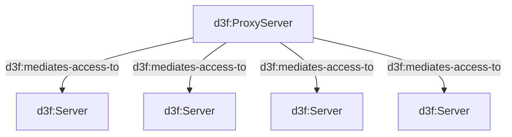

# 32. Grouping by relation is not a container node

Date: 2026-07-09

## Status

Rejected

## Context

A diagram may contain multiple relations that could be better
represented via container nodes.
The problem is that those relations might not be transitive.

ex:



This is represented by 4 links in the Graph view.

Does it make sense to have a feature capable of
grouping these relations and show someting like that
in cytoscape

```text
proxy -->|d3f:mediates-access-to| proxy-mediates-access-to

subgraph proxy-mediates-access-to
h1
h2
h3
h4
end
```

It does not, on four grounds that hold independently of
each other.

**A compound node is a tree; a relation's target set is
not.** A node has one parent, and the first one wins —
the compound structure is a tree, not a DAG. A target set
has no such discipline: two proxies mediating access to
one host want two boxes over the same node, and a host
already inside a `d3f:contains` container has no parent
left to give. [ADR 0031](0031-architecture-templates.md)
already had to settle a contest of this kind and settled
it for containment, so a box drawn by a relation would
lose every contest it entered and appear only where the
diagram had nothing else to say. A feature that works
until the drawing gets interesting is not a feature.

**Nesting is what a box gives for free, and a
non-transitive predicate cannot honour it.** This is the
worry above, and D3FEND settles it: the ontology declares
five transitive object properties, and four of them are
the containment family — `contains`, `contained-by`,
`may-contain` and `may-be-contained-by`. Containment can
be drawn as a box precisely because a box inside a box
composes into the claim the reader already reads off it.
`d3f:mediates-access-to` composes into nothing, so a
grouping box nested inside another one would draw a path
nobody asserted, and there is no way to draw a box that
declines to nest.

**The box already means one thing too many.**
[ADR 0016](0016-nodes-outside-their-container.md) states
the invariant — what is drawn inside a container is what
it contains — and
[ADR 0031](0031-architecture-templates.md) widened it once,
to instance membership, booking "a container's box stops
having one meaning" as the price. Grouping by relation is
not a third meaning to add to those two. It is one box
shape per predicate the diagram happens to use, and a
reader who cannot tell containment from membership by
looking has no chance against that.

**The arithmetic does not pay.**
[ADR 0026](0026-collapse-artifact-mediated-paths.md)
refused fan-out *and* fan-in because `N*M` derived arrows
in place of `N+M` written ones is not a simplification.
Here N arrows become one arrow, plus a synthetic node,
plus N memberships expressed as geometry rather than as
lines — a saving only for large N. Across the example
corpus the largest same-subject-same-predicate fan-out is
four, and the median is one. `multi-graph.md` holds the
one literal instance of the sketch above, `CDN d3f:mediates-access-to dc-1, dc-2`, and it is exactly the
case the grouping would damage: the two data centres are
joined to each other by `d3f:communicates-with`, which the
box would swallow as an internal detail, and each is a
container with children of its own in the next diagram
down.

One objection closes here rather than in the Decision. The
grouping the author typed is not lost by accident — an
`&`-joined group is a single arrow in the parse — but it
never reaches the RDF, and
[ADR 0014](0014-graph-view-from-rdf-only.md) forbids the
view reading anything else. So the group would have to be
re-derived structurally from the store, the way ADR 0026
re-derives a message path. That is possible; the fourth
ground says there is not enough of it to be worth
deriving.

Alternatives considered:

- **A fold-style stack instead of a box.** One synthetic
  node standing for the N targets, with no parent link to
  them at all — they are simply not drawn — reusing the
  folded node's styling, its count and its `×N` arrow
  label, and ADR 0026's provenance channel so the edge
  panel still names the real triples. It escapes the first
  three grounds outright, because it contests no parent
  slot and claims no containment. It does not escape the
  fourth, and it needs a refusal list of its own — the
  target must have no other drawn link, no children, no
  parent, and a class shared with the rest of the group —
  strict enough that `multi-graph.md` refuses it too. It
  is machinery for a case the corpus does not contain, and
  it would be the second view transform that silently
  changes the drawing's shape as the model grows a link.
- **Bundling the arrows without a node**, drawing the N
  edges as one thick curve with a count. This is what
  [ADR 0012](0012-fold-container-nodes.md) already does
  when several child links land on the same pair, and it
  does not generalise: there the pair really is one pair,
  and here the N targets are N different nodes with N
  different positions. A curve to four places is four
  curves.
- **Accept the arrows.** The baseline, and the decision
  below. The complaint the sketch answers is visual noise,
  and the reader already has three tools for it that cost
  no new semantics: the Links filter hides a kind of
  relation entirely, path focus dims everything off the
  chain being read, and folding a container removes a
  whole subtree and counts what it removed.

## Decision

- [x] **A container's box means containment
  ([ADR 0016](0016-nodes-outside-their-container.md)) or
  instance membership
  ([ADR 0031](0031-architecture-templates.md)), and
  nothing else.** No further widening: two meanings is
  already one more than a reader can resolve by looking,
  and the next one would be unbounded, since it is drawn
  per predicate rather than per kind of claim.
- [x] **A predicate that is not transitive MUST NOT be
  drawn as a box.** Boxes nest, and a reader reads the
  nesting; a predicate that does not compose has nothing
  true to say about a box inside a box.
- [x] **A same-predicate fan-out is drawn as the arrows
  the author wrote.** Nothing is derived, nothing is
  hidden, and the drawing keeps saying what the store
  says.
- [x] **Noise from a wide fan-out is a reading problem,
  answered by the reading tools** — the Links filter, path
  focus, and container folding — not by a new element in
  the drawing.
- [x] **The stack is refused too, not deferred.** It is a
  sound design and it is recorded above so a later reader
  can see it was weighed; what it lacks is a diagram that
  needs it. Should one appear, this ADR is superseded
  rather than amended, because the stack is a different
  decision from the one refused here.

## Consequences

Pros:

- A box keeps the two meanings it has, so
  [ADR 0016](0016-nodes-outside-their-container.md)'s
  invariant stays checkable and the separation pass keeps
  needing to know nothing about what made a parent.
- No new synthetic element, so nothing new has to be
  taught to the node panel, the edge panel, go-to-source,
  the chips, the fold or the layouts — the five places
  [ADR 0026](0026-collapse-artifact-mediated-paths.md) had
  to teach.
- The drawing keeps standing in one-to-one correspondence
  with the store for this class of relation, which is what
  makes a fan-out countable by eye.
- The reasons are on the record, so the question can be
  reopened with evidence — a diagram whose fan-out is
  wide — rather than reopened from scratch.

Cons:

- A genuinely wide fan-out is still N arrows, and the
  drawing offers nothing that makes it narrower. The
  reader's answer is to filter the link kind, focus the
  path, or fold a container, and none of those is aimed at
  this shape in particular.
- Refusing the stack refuses a real simplification for the
  diagram that eventually needs it, and the cost of that
  refusal is paid by whoever draws that diagram first.
- The refusal is invisible from inside the app: a user who
  expects grouping finds no preference and no menu item
  saying why there is none.

## DONTREADME

Notes for LLM agents. They describe the code as it is, not
the decision, and go stale: check the code before trusting
them.

- A subgraph whose title names a property writes that
  predicate from each member instead of `d3f:contains`
  ([ADR 0034](0034-platform-topology-and-location.md)),
  and the box is then *not* drawn as a container — the
  members get arrows, which is what this ADR decided. So
  the two decisions agree: nothing is grouped by a
  non-transitive relation. Should that ever be wanted,
  the seam is `MEMBERSHIP_PREDICATES` in
  [rdf/graphModel.js](../../app/src/rdf/graphModel.js) —
  the same member-stated shape `ds:partOf` already has —
  and it supersedes this ADR rather than amending it.
- The single-parent rule is `parentOf` in
  [rdf/graphModel.js](../../app/src/rdf/graphModel.js) —
  `if (!parentOf.has(...)) parentOf.set(...)`, commented
  "cytoscape compound nodes are a tree, not a DAG".
  `buildGraphModel` returns `{ nodes, edges, containment, parentOf }`.
- The two predicate sets that make a parent are
  `CONTAINMENT_PREDICATES` (`d3f:contains`) and
  `MEMBERSHIP_PREDICATES` (`ds:partOf`, stated from the
  member's side) in the same file. Membership is applied
  in a second pass after the quad loop, and skips a child
  containment already claimed.
- `data.parent` is set in exactly one place: step 4 of
  `toCytoscapeElements` in
  [viz/toCytoscape.js](../../app/src/viz/toCytoscape.js),
  from `visibleParentOf(iri)`, which walks up `parentOf`
  to the nearest ancestor surviving the node filter.
  `data.isContainer` is derived — a node with at least one
  drawn child — and is not an assertion.
- The five `owl:TransitiveProperty` object properties are
  in the D3FEND ontology file at the repo root:
  `d3fend:contains`, `contained-by`, `may-contain`,
  `may-be-contained-by`, `process-ancestor`.
- The `&`-group fact is `parseEdgeLine` in
  [parser/edgeParser.js](../../app/src/parser/edgeParser.js):
  the endpoints are split on `&` and the resulting edges
  share an `arrowIndex`. `arrowIndex` is excluded from the
  RDF path by name, which
  [ADR 0026](0026-collapse-artifact-mediated-paths.md)
  also relies on.
- The fan-out measurement is over
  `app/src/data/examples/`. The wide case is `action d3f:runs` in `ci-artifact-generation.md` (four targets,
  and one of them points back at `action`); the sketch's
  own case is `multi-graph.md`, first diagram.
