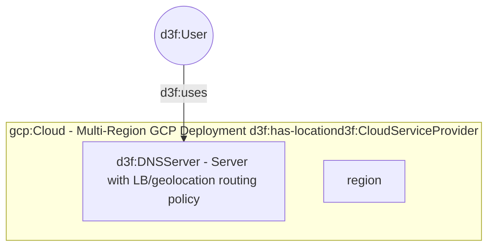
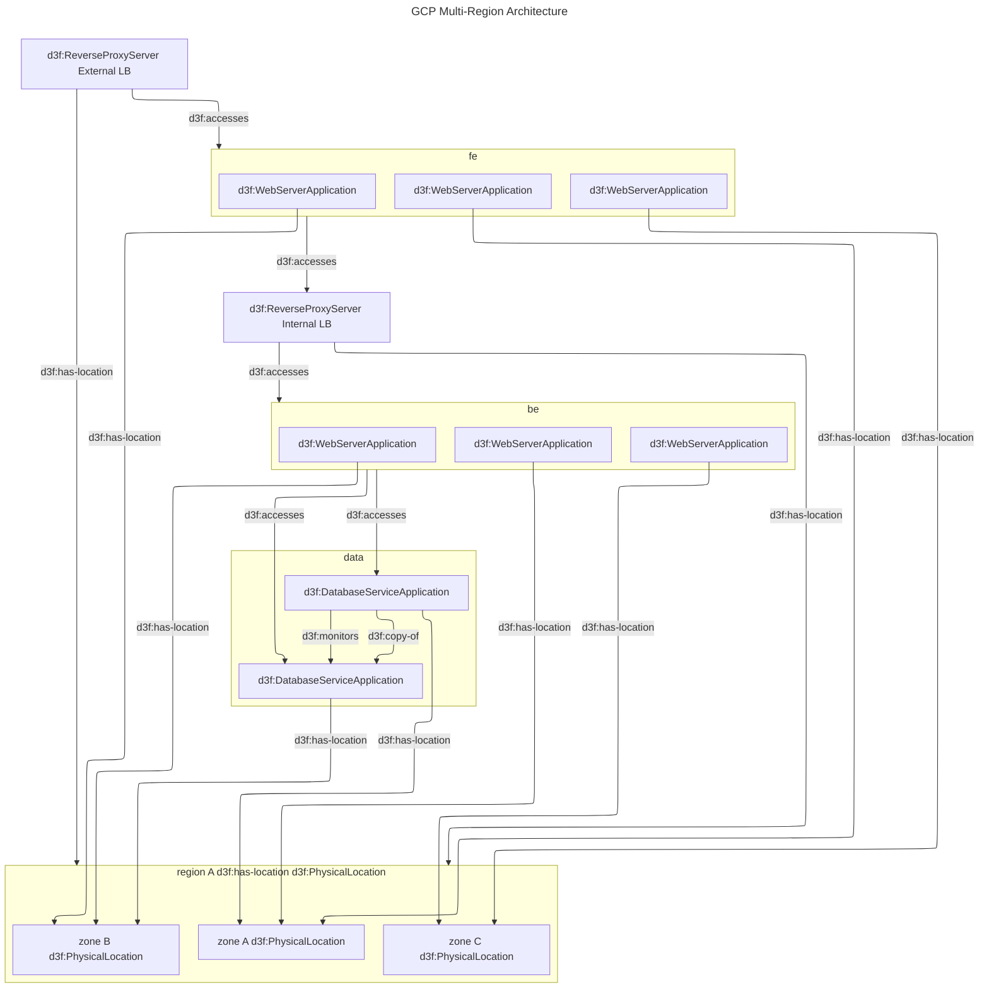
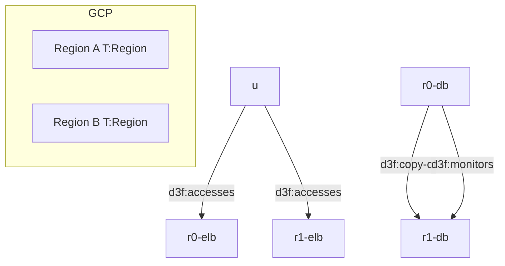

# GCP Multi-Region Architecture

see: <https://docs.cloud.google.com/architecture/deployment-archetypes/multiregional?hl=it>

This diagram reusess the above template
to replicate the infrastructure blocks on two regions.

