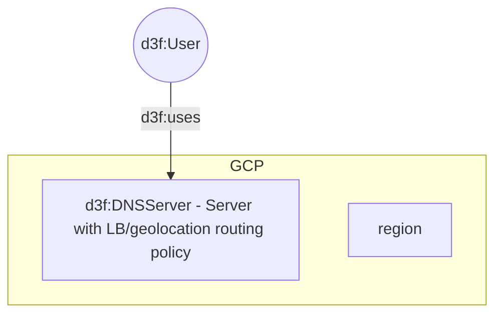
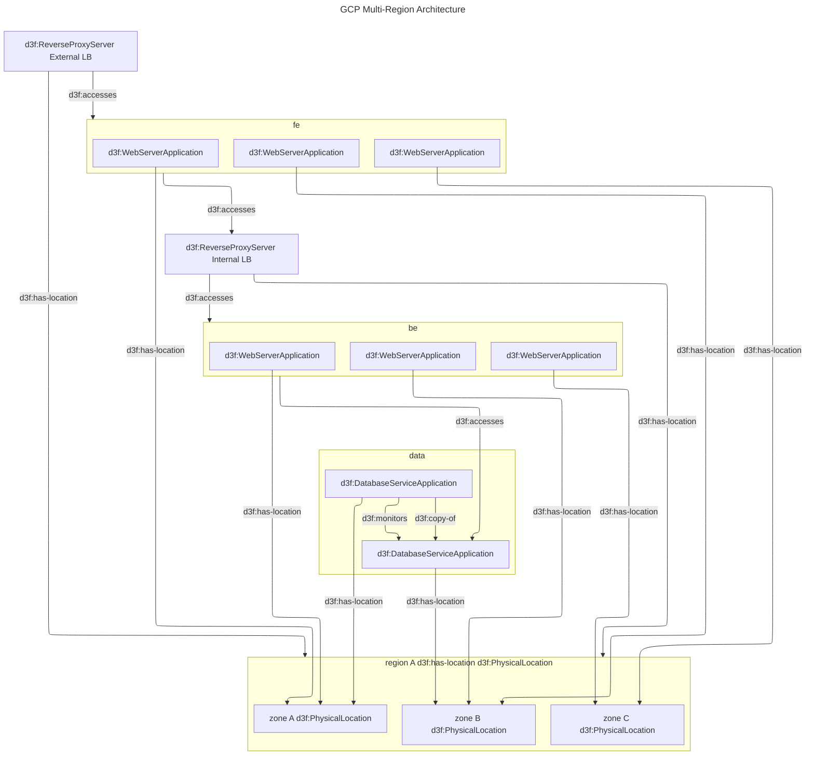
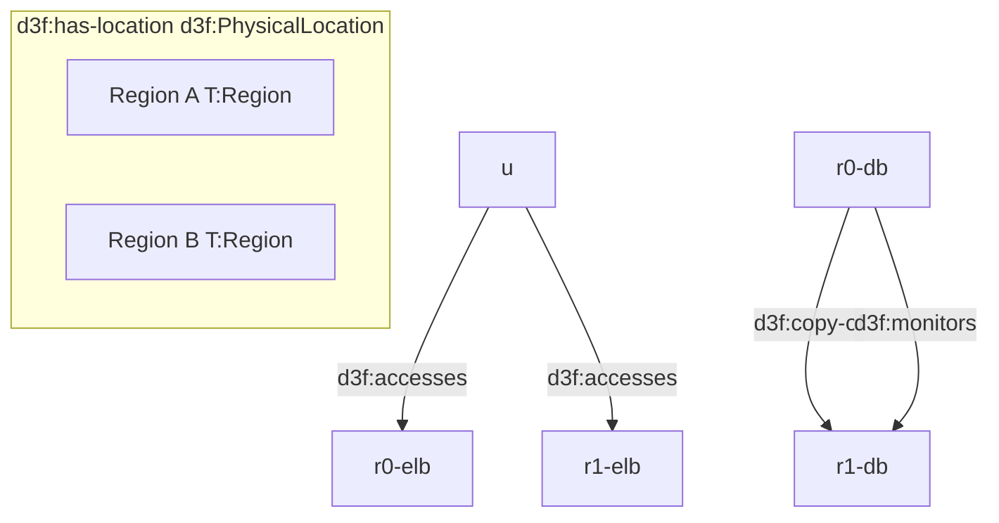

# GCP Multi-Region Architecture

see: <https://docs.cloud.google.com/architecture/deployment-archetypes/multiregional?hl=it>

```mermaid
graph

u((d3f:User))

GCP[gcp:Cloud - Multi-Region GCP Deployment d3f:CloudServiceProvider]
dns[d3f:DNSServer - Server with LB/geolocation routing policy]

subgraph GCP
region
dns
end

u -->|d3f:uses| dns
```

```mermaid
---
title: GCP Multi-Region Architecture
kind: template
id: Region
root: region
config:
  layout: elk
---
graph


subgraph region[region A d3f:has-location d3f:PhysicalLocation]
zone-a[zone A d3f:PhysicalLocation]
zone-b[zone B d3f:PhysicalLocation]
zone-c[zone C d3f:PhysicalLocation]
end

elb & ilb -->|d3f:has-location| region

elb[d3f:ReverseProxyServer External LB]

elb -->|d3f:accesses| fe


%% :idea:
%% d3f:Artifact -->|d3f:whatever| subgraph
%% means d3f:Artifact d3f:whatever ....
%% evaluate this pattern with examples.
%% problems may arise with subgraphs, but
%% simplifies representations.
subgraph fe
  fe-a[d3f:WebServerApplication]
  fe-b[d3f:WebServerApplication]
  fe-c[d3f:WebServerApplication]
end


fe-a & be-a -->|d3f:has-location| zone-a
fe-b & be-b -->|d3f:has-location| zone-b
fe-c & be-c -->|d3f:has-location| zone-c

ilb[d3f:ReverseProxyServer Internal LB]

subgraph be
  be-a[d3f:WebServerApplication]
  be-b[d3f:WebServerApplication]
  be-c[d3f:WebServerApplication]
end

fe -->|d3f:accesses| ilb
ilb -->|d3f:accesses| be

be -->|d3f:accesses| db
db[d3f:DatabaseServiceApplication]

subgraph data
  db-standby[d3f:DatabaseServiceApplication]

  db-standby -->|d3f:copy-of| db
  db-standby -->|d3f:monitors| db
  db-standby -->|d3f:has-location| zone-a
  db -->|d3f:has-location| zone-b
end
```

```mermaid
graph

u -->|d3f:accesses| r0-elb & r1-elb
subgraph GCP[d3f:has-location d3f:PhysicalLocation]
  r0[Region A T:Region]
  r1[Region B T:Region]
end

r0-db -->|d3f:copy-of| r1-db
r0-db -->|d3f:monitors| r1-db
```
